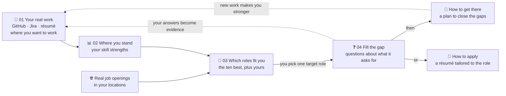

# CareerPolaris

*Formerly Job Searching Advisor. The repository, images and compose projects
keep the old `job-searching-advisor` / `jsa` names.*

**Know where you stand, see which real jobs fit you, and close the gap to the
one you want.** Everything is built from the work you have actually done.

## The problem it solves

Looking for your next job usually means guessing. You don't know how your skills
compare to what the market is hiring for, which roles you could realistically
land, what it would take to reach the one you want, or how to present your work
for it. Your résumé undersells you, and advice from job boards is generic.

CareerPolaris answers those questions from evidence: your GitHub, your
Jira and your résumé, measured against real job openings.



Every claim it makes cites your own work, and all AI runs on **your own LLM
key**.

## What it does

| Feature | What you get |
|---|---|
| **Profile & evidence** | Connect GitHub and Jira, upload a résumé, and choose up to three places you want to work. Sources are parsed into evidence, with no AI involved, and your answers from Fill the gap join them as "Your answers". |
| **Strength report** | A radar chart of 5–10 skill dimensions derived from *your* profile, not a fixed taxonomy, listed least certain first, with a profile confidence that says how well your evidence backs the scores overall. |
| **Role map** | A bubble chart of the roles your strengths point to, found in the real market. The x axis is the hiring bar, the y axis is salary and the bubble size is fit. Each analysis recommends roles from your strengths, and the map shows the first ten with openings in your target locations, naming the ones without ([ADR 0024](docs/decisions/0024-recommend-roles-from-the-assessment-and-keep-the-ten-the-market-has.md)), and is built after every analysis, confirmed with the analysis's cost ([ADR 0020](docs/decisions/0020-analyse-ten-roles-and-build-the-map-after-every-analysis.md)), or when you rebuild it. Each build searches the market for your recommended roles first and keeps the ten that read most like your strengths; the map says how old its market data is ([ADR 0027](docs/decisions/0027-fetch-the-market-only-when-a-build-needs-it.md)). |
| **Fill the gap** | The Advisor's first step: a few questions for each gap between your evidence and your target role, each saying why it is asked and what closing the gap is worth. Submit them together; your answers become evidence, at no cost. Your gap plan and résumé then say they are outdated, and you regenerate them when you choose ([ADR 0023](docs/decisions/0023-ask-questions-per-gap-of-the-target-in-fill-the-gap.md), [ADR 0035](docs/decisions/0035-regenerate-the-plan-and-resume-only-when-asked.md)). |
| **Gap plan** | Aim at one **Target** from the role map — a role, and optionally one opening in it ([ADR 0022](docs/decisions/0022-make-a-target-a-role-and-an-optional-opening.md)) — and get gaps ranked by the fit points each is worth, broken into milestones, tasks and projects. Plans are versioned per Target, and finished work carries forward. |
| **Résumé** | A résumé written for the Target from cited evidence, with requirement coverage, in-place editing saved as versions, a streamed revision chat whose proposals apply only when you accept them, and PDF export. |
| **Accounts** | Email and password sign-in, or optional sign-in with Google. A write-only AI credential, plus a usage budget and ledger. |

Not built yet: suggesting a successor Target when a role splits, interview
reports (the hiring bar is estimated for now), email verification and password
reset, and linking or unlinking Google from Settings. See [`docs/plan.md`](docs/plan.md).

## How it is built

Design choices that are deliberate:

- **The crawler holds no secrets** and has no grant on any user schema. It
  fetches only what a role-map build is waiting for, and nothing it learns is
  ever resolved to users ([ADR 0027](docs/decisions/0027-fetch-the-market-only-when-a-build-needs-it.md)).
- **Privacy is a storage location, not a flag.** Pasted JDs live in
  `market_user`, which the crawler's database role cannot reach.
- **Row-level security on every owner-zone table**, keyed on a per-transaction
  `app.user_id`. A forgotten `WHERE owner_id` returns nothing, not someone
  else's rows.
- **The AI credential is write-only.** Reading it back returns only the
  provider, the model and the last four characters.
- **Nothing reaches an LLM except through `kernel.ai_gateway`.** The gateway
  estimates cost, checks the budget, decrypts the key for exactly one call,
  validates the output against a schema and writes a ledger row.
- **Glassdoor, Indeed and LinkedIn are not crawled.** Market data comes from
  public ATS boards, schema.org JSON-LD career pages, the Himalayas public API
  for remote work ([ADR 0025](docs/decisions/0025-search-himalayas-for-the-candidate-roles.md))
  and JDs that users paste.

**Stack:** Python 3.12, FastAPI, Pydantic v2, SQLAlchemy 2 and Alembic on
Postgres. Procrastinate for jobs (no Redis). sentence-transformers
for local embedding and matching. WeasyPrint for PDFs. React and Vite with an
`openapi-typescript` client generated from the API. Details are in
[`docs/architecture.md`](docs/architecture.md).

## Getting started

You need **Docker** and **`make`**, and nothing else. Every toolchain, database,
linter and migration runs in a container.

```sh
cp .env.example .env      # fill in every blank
make build-infra          # pull the pinned Postgres and MinIO images
make build-app            # build the prod images, plus the test images the gates use
make start-infra          # start infra, wait until healthy, create least-privilege DB roles
make start-app            # run migrations to completion, then start api, worker, crawler and web
```

Open **http://localhost:21471**. The host ports are this repo's block:

| Port | Service |
|---|---|
| `21470` | api |
| `21471` | web |
| `21472` | Postgres |
| `21473` | MinIO |
| `21474` | MinIO console |

To stop, run `make stop-app` and then `make stop-infra`. `stop-infra` keeps your
data. Only `make clean-up-infra` deletes it.

### Developing with live source

```sh
make build-app MODE=dev   # once, and again after a dependency change
make start-app MODE=dev
```

This bind-mounts `backend/` and `web/src` read-only. When you save a file, the
api, the worker and the SPA (through Vite HMR) reload within a couple of
seconds. The crawler does not reload, because it would hit real job boards on
every save. `MODE` defaults to `prod`, which has nothing mounted and is the only
mode CI and deployed environments use.

## Tests and quality gates

```sh
make test-unit                   # hermetic: runs with --network none
make test-integration            # needs `make start-infra` first
make test-unit PATTERN=rolemap   # narrow either tier
make lint
make typecheck
make scan                        # Python and npm dependencies, plus the prod images (Trivy)
```

Supporting targets, which are never dependencies of the targets above:
`migrate`, `format`, `gen-client` (regenerates the TypeScript API client),
`lock` (regenerates `backend/uv.lock`), `logs`, `stats` (CPU, memory and
restarts per container, against its limit), `disk-usage` (free disk, volumes,
the largest tables, buckets), `clean-up-cache` (deletes tool caches and build
output, all regenerated on the next run) and `clean-up-infra`, which is the
only destructive one.

## Repository layout

```
backend/
  src/
    api/      FastAPI app and one router per component
    worker/   queue worker and outbox dispatcher
    crawler/  its own deployable: the crawl loop, no secrets
    cli/      migrate, seed, OpenAPI export
    wiring/   composition root shared by every deployable
    kernel/   technical kernel with no domain logic: db, outbox, jobs, auth, crypto,
              storage, ai_gateway, fetch, embeddings
    advisor/  identity · profile · market · rolemap · assessment · target · gapplan · resume · activity
                __init__.py  the only importable surface; submodules are private
                service.py use cases · domain/ pure rules · infra/ models and adapters
  migrations/ Alembic
  tests/      unit/ and integration/, each mirroring src/
web/          React + Vite SPA on the prototype's design system (ADR 0004)
infra/        infra compose project, DB role bootstrap, health wait
prototype/    design reference screens for the v3 journey (prototype/README.md)
docs/         domain model, architecture, plan, decisions
```

Twenty-two `import-linter` contracts in `backend/.importlinter` enforce the module
boundaries in CI. If one of them breaks, the design is wrong, not the contract.

## Documentation

| Document | What it covers |
|---|---|
| [`docs/domain_model.md`](docs/domain_model.md) | The domain model, bounded contexts and the decisions behind them |
| [`docs/architecture.md`](docs/architecture.md) | Deployables, module dependencies, data and trust boundaries, the AI gateway, flows and technical decisions |
| [`docs/technical/task-queue.md`](docs/technical/task-queue.md) | Task submission, outbox dispatch, worker execution and status polling, with data-flow diagrams |
| [`docs/technical/strength-analysis.md`](docs/technical/strength-analysis.md) | The strength analysis, from the confirmed estimate to the stored report and the candidate roles it hands the role map |
| [`docs/technical/role-map-build.md`](docs/technical/role-map-build.md) | A role-map build: what asks for one, the on-demand market fetch it waits for, choosing and analysing the ten, and the fits after |
| [`docs/plan.md`](docs/plan.md) | Scope for phases 1–4, and the Phase 5 refactoring steps |
| [`prototype/`](prototype/README.md) | The design reference: one screen per file, and the domain spec it was reviewed with |
| [`docs/decisions/`](docs/decisions/README.md) | Decision records for choices that are costly to reverse |
