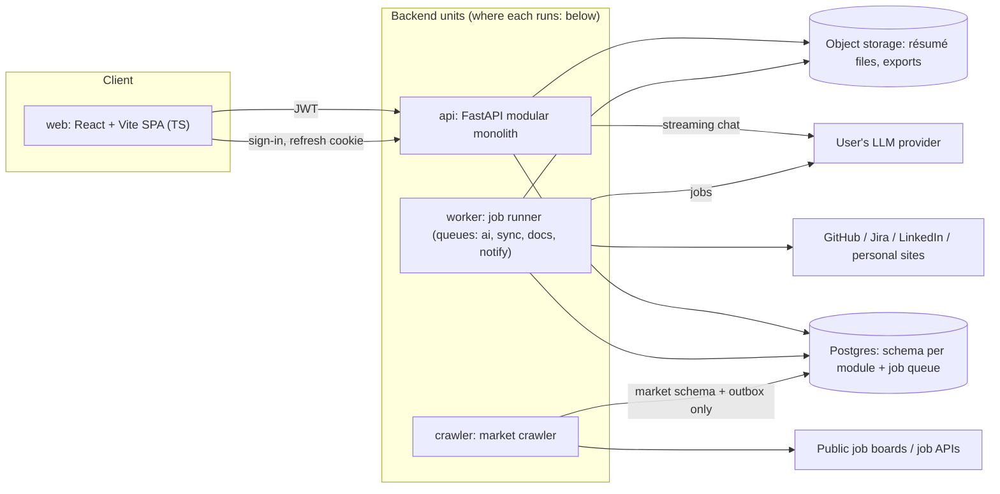
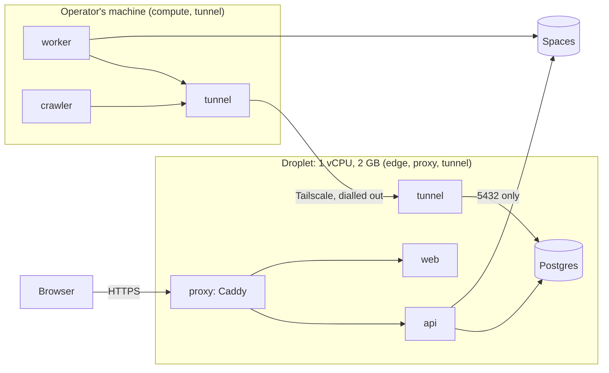
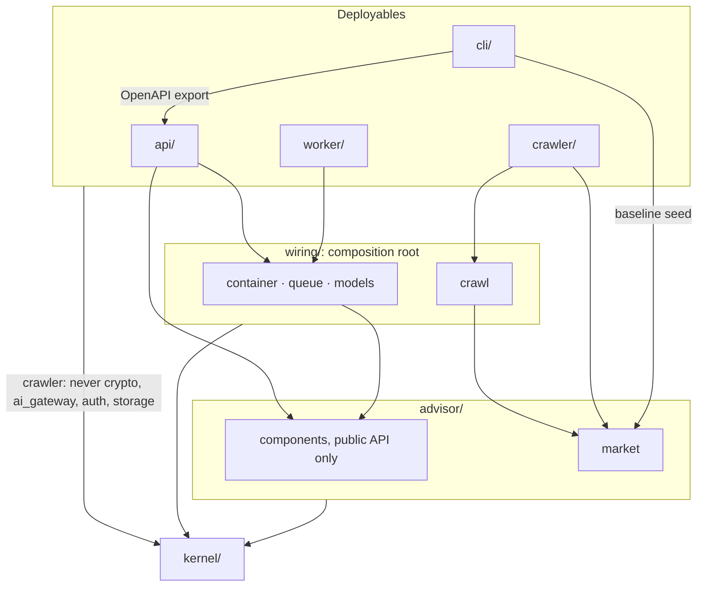
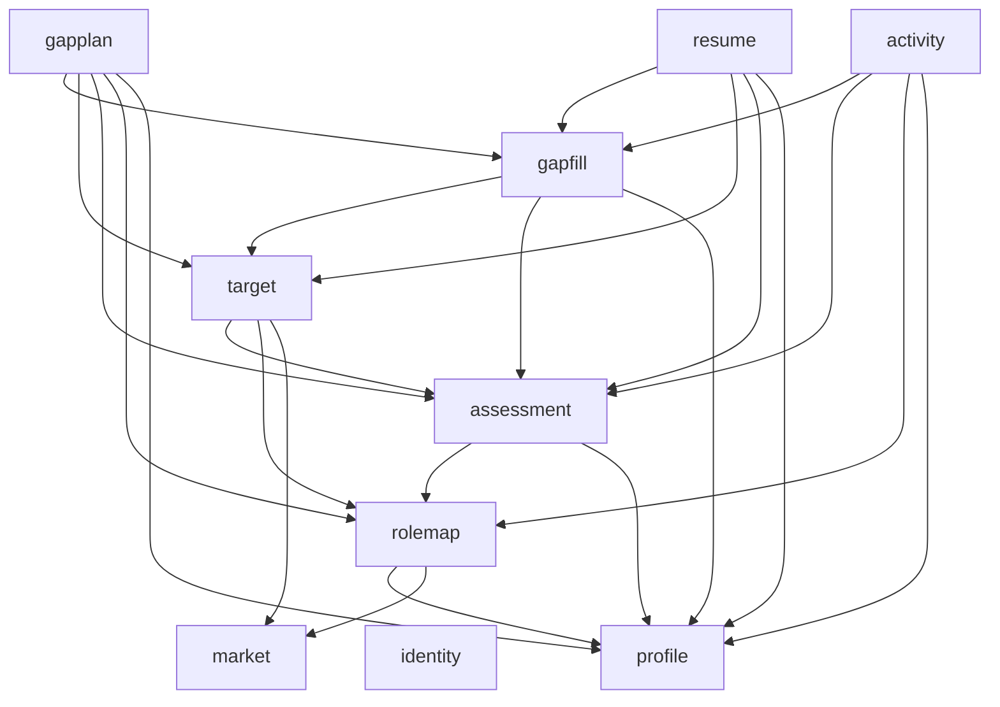
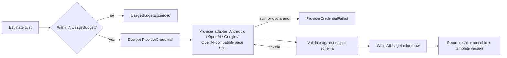

# Architecture: CareerPolaris

This doc turns the domain model in [`domain_model.md`](domain_model.md) into an architecture. It covers what gets deployed separately, who owns which data, where secrets can be decrypted, where untrusted input enters, how modules talk to each other, and the decisions behind all of it.

**Constraints:** modular monolith plus workers · Python backend, TypeScript client · a 1 vCPU / 2 GB droplet plus the operator's own machine ([ADR 0051](decisions/0051-run-the-edge-on-a-droplet-and-the-heavy-work-on-the-operators-machine.md)) · solo or small-team MVP · local embedding model for matching postings · own email-and-password sign-in ([ADR 0001](decisions/0001-run-our-own-email-password-sign-in.md)).

> **This describes the v3 design** (domain decisions 21–28), which the code now follows. [`plan.md`](plan.md) Phase 5 records the steps that got it there, and what each left for later.

## 1. Deployable units



| Unit | Responsibility | Can decrypt secrets? | Egress |
|---|---|---|---|
| `web` | SPA for the prototype's screens; no business rules, no AI calls | No | API, auth provider |
| `api` | HTTP + SSE, routers for every module, résumé chat streaming | **AI key only** (for chat streaming) | User's LLM provider |
| `worker` | Queued and scheduled jobs: `ai` (assessment, the per-user role map of the top k recommended roles, fit, reading and scoring postings of the user's own, gap-fill questions, gap plans per Target, résumé writing, difficulty estimates), `sync` (connectors, résumé parsing — **no AI**, domain decision 18), `docs` (résumé PDF export with WeasyPrint, ADR 0007), `notify` (interview prompts — not built yet) | AI key (`ai` queue), connector OAuth tokens (`sync` queue) | LLM provider, GitHub/Jira/LinkedIn, personal sites, email |
| `crawler` | Fetches only the sources a role-map build is waiting for ([ADR 0027](decisions/0027-fetch-the-market-only-when-a-build-needs-it.md)) — company boards, and searches of a public job API for the roles analyses recommend ([ADR 0025](decisions/0025-search-himalayas-for-the-candidate-roles.md)) — looking every few seconds: parse, normalize, dedup, embed, replace a search's result list or expire a board's missing postings, then mark them fetched. Backs off a host that refuses it, caps each host's requests per day, and once a day retires idle searches and thins postings nothing holds | **None** | Public job boards and job APIs (SSRF-guarded) |

| `proxy` | Caddy on 80/443, the only unit on the internet: TLS for `SITE_HOSTNAME`, `/api/*` to the api and the rest to `web`, a cap on request bodies, timeouts for slow clients, and limits per client address ([ADR 0053](decisions/0053-put-caddy-at-the-edge-with-per-address-limits-and-no-api-gateway.md)) | **None** | Let's Encrypt |

### Where each unit runs ([ADR 0051](decisions/0051-run-the-edge-on-a-droplet-and-the-heavy-work-on-the-operators-machine.md))



- **What runs where** is `COMPOSE_PROFILES` in each place's `.env`. There is
  one image and one pair of compose files. Development and CI run
  `edge,compute,local` on one machine, with MinIO in place of Spaces.
- **The compute machine may be off.** The queue and the outbox are in
  Postgres on the edge, so work waits for it. The worker and the crawler each
  write a heartbeat to `presence.process`. Lost-work limits and a build's
  market deadline count only the time the process they need has been up,
  and `GET /activity` reports `processing`
  ([ADR 0052](decisions/0052-let-work-wait-for-the-processing-machine-instead-of-reporting-it-lost.md)).
- **Migrations.** Both places migrate when they start, under an advisory
  lock. An image older than the schema refuses to start.
- **Releases.** CI pushes multi-platform images, and each place pulls them by
  digest ([ADR 0055](decisions/0055-release-multi-platform-images-by-digest-from-ci.md)).
- **Runbook:** [`deploy.md`](deploy.md).

**Why the crawler is its own unit:**
- It has a different trust level: it parses hostile HTML from the internet.
- It runs on its own loop: a short poll for due sources, and a daily sweep.
- It holds no secrets and never reads user data.

The worker queues share one image for the MVP. Split them later by giving each queue its own process group, e.g. when PDF rendering's memory use starts crowding out AI jobs.

### Stack
| Layer | Choice | Why |
|---|---|---|
| API | Python 3.12, FastAPI, Pydantic v2 | Pydantic models are used for both API contracts and LLM output validation |
| Persistence | Postgres, SQLAlchemy 2, Alembic | One managed database for data, queue and outbox |
| Jobs | Procrastinate (Postgres-backed, periodic tasks) | No Redis at MVP scale |
| Documents | WeasyPrint (PDF export, [ADR 0007](decisions/0007-render-resume-pdfs-with-weasyprint.md)), pypdf / python-docx (parsing) | No browser in the image; the export fetches nothing. Caprasimo and Figtree are installed for it, beside the image's DejaVu, and its look is the domain's, which the preview reads too ([ADR 0038](decisions/0038-export-the-resume-as-previewed-and-download-it.md)): a template's checked spec, built in or the user's own ([ADR 0040](decisions/0040-keep-resume-templates-as-checked-specs.md)) |
| Local ML | sentence-transformers | Works with every LLM provider, including Anthropic, which has no embeddings API |
| Client | React + Vite, `openapi-typescript` client generated from FastAPI's OpenAPI; the SPA's response types alias it | The API contract is the client/server boundary, checked in CI down to the SPA's typecheck ([ADR 0013](decisions/0013-type-every-http-response-with-a-schema-model.md)) |
| Auth | Own sign-in in `identity`: Argon2id, 15-minute HS256 access tokens, rotating refresh cookie; optional Google through our own OpenID Connect exchange | No external account needed to run the app; see [ADR 0001](decisions/0001-run-our-own-email-password-sign-in.md) and [ADR 0008](decisions/0008-sign-in-with-google-by-our-own-oidc-exchange.md) |

## 2. Code boundaries inside the monolith

```
backend/src/
  api/                      # FastAPI: main.py, dependencies, error envelope, routes/<c>.py, schemas/<c>.py
  worker/                   # queue worker entrypoint + the outbox dispatcher
  crawler/                  # separate deployable: the crawl loop only
  cli/                      # migrate, job-queue schema, baseline seed, OpenAPI export
  wiring/                   # composition root: container.py, crawl.py (the crawler's), queue.py, models.py
  kernel/                   # shared technical kernel, no domain logic
    db/ outbox/ jobs/ auth/ crypto/ storage/ ai_gateway/ fetch/ embeddings/
  advisor/                  # the application: one package per component, no framework code
    identity/  profile/  market/  rolemap/  assessment/  target/  gapfill/  gapplan/  resume/  activity/
      __init__.py           # the ONLY importable surface: service interface, views, job functions
      service.py           # use cases: data only through domain/repositories.py (ADR 0011)
      domain/              # one module per concept + repositories.py, events.py, constants.py; pure Python, no I/O
      infra/               # ORM models, mappers, SqlAlchemy* repositories + unit of work, adapters
      factory.py           # create_<c>_service(database, ...): the only place infra is wired in
      jobs.py              # use cases the worker runs
    market/crawling/       # board adapters, discovery, politeness, one crawl run
web/                        # TS client
```

> The backend is packaged by component ([ADR 0009](decisions/0009-package-the-backend-by-component.md), after the design guideline's ADR 0003). A component owns its domain model, use cases and data access, its `__init__.py` is its public API, and its submodules are private. Before 2026-09-27 the domain model sat in a top-level `domain/` folder beside `modules/<m>/{public,api,jobs,infra}`, so older ADRs cite paths like `modules/rolemap/public.py` and `domain/rolemap/selection.py`. Those are now `advisor/rolemap/service.py` and `advisor/rolemap/domain/selection.py`.
>
> `kernel/` stays outside the application on purpose: it is infrastructure, and the rules below name its packages. It is named `kernel`, not `platform`, because `platform` would shadow Python's standard-library module.
>
> `gapplan` replaces the earlier `growth`: with no CareerGoal (domain decision 16), the component is about plans for a Target and nothing else. The Target itself has its own component, `target`, because `gapfill`, `gapplan` and `resume` all aim at one and none of them may own it ([ADR 0005](decisions/0005-resolve-targets-in-their-own-module.md)). `target` resolves a Target (a role, and optionally an opening in it, domain decision 26) through other components' public APIs and hands back a frozen snapshot that the consumer stores. Its only tables are the postings of the user's own, which it keeps and scores with the role map's fit kit ([ADR 0033](decisions/0033-keep-a-posting-of-your-own-in-target.md)). `resume` serves its routes under `/tailored-resumes`, because `/resumes` is the profile's, for uploaded files.
>
> `gapfill` owns the Advisor's first step (domain decision 27): the questions written for one Target's gaps, and the one submit that turns the answers into evidence. It sits below `gapplan` and `resume` because both read what it records when they are regenerated, and above `target` because its questions are about a Target. Follow-up questions used to live in `assessment`, driven by low confidence ([ADR 0012](decisions/0012-generate-follow-up-questions-when-evidence-changes.md)); that path goes away with it.

### Top-level dependencies

An arrow means "imports"; an arrow from a group means every package in it imports the target. Nothing points upward: the deployables sit on top, `wiring/` composes, and the application and the kernel never import either of them.



| Package | Responsibility | May import |
|---|---|---|
| `api/` | HTTP and SSE delivery: routes and request/response schemas per component, request dependencies, the error envelope, and one page envelope for every list ([ADR 0014](decisions/0014-page-every-list-response.md)) | `advisor` components, `wiring.container`, `wiring.queue`, `kernel` |
| `worker/` | Queue worker entrypoint, and the outbox dispatcher that turns one user's events into their jobs | `wiring.container`, `wiring.queue`, `kernel` |
| `crawler/` | The crawl loop and nothing else; holds no secrets and reads no user data | `advisor.market`, `wiring.crawl`, a secret-free subset of `kernel` |
| `cli/` | One-off commands: migrate, job-queue schema, baseline seed, OpenAPI export | `advisor.market`, `api.main`, `kernel` |
| `wiring/` | Composition root: `container` builds every component from its `factory`, `queue` registers each component's `jobs`, `crawl` is the crawler's narrow wiring, `models` gathers ORM models for migrations | `advisor` components, `kernel` |
| `advisor/` | The application, one component per capability; no framework or delivery code | other components (in the order below), `kernel` |
| `kernel/` | Technical kernel: `db`, `outbox`, `jobs`, `auth`, `crypto`, `storage`, `ai_gateway`, `fetch`, `embeddings`, plus config, logging, errors, clock, paging, parsing | nothing above it |

Inside `advisor/`, components depend on each other in one direction (rule 5). `gapplan`, `resume` and `activity` are siblings and must not import each other; `identity`, `profile` and `market` import no other component.



| Component | Uses | Responsibility |
|---|---|---|
| `identity` | none | Accounts, password and Google sign-in, sessions, and the write-only AI credential |
| `profile` | none | Evidence: GitHub and Jira connectors, résumé upload and parsing; never reaches the AI gateway (rule 10) |
| `market` | none | Openings: board adapters, board URLs and politeness (`crawling/`), the baseline seed, the user's 1–3 target locations, posting embeddings |
| `rolemap` | market | Holds the candidate roles each analysis recommends, and keeps the top k the user's market has openings for ([ADR 0024](decisions/0024-recommend-roles-from-the-assessment-and-keep-the-ten-the-market-has.md)). Lends `target` a stateless fit kit — reading a JD's requirements, projecting them, working a fit out — so a posting of the user's own is scored by the same rules, though never on the map ([ADR 0033](decisions/0033-keep-a-posting-of-your-own-in-target.md)). Scores each role's RoleFit against the dimension scores the analysis hands over, and ranks the openings inside the roles by it ([ADR 0028](decisions/0028-score-the-fit-in-the-role-map.md)) |
| `assessment` | profile, rolemap | Skill dimensions and the strength report with per-dimension and profile confidence; hands the candidate roles, and the scores their fits are taken against, to `rolemap` |
| `target` | market, rolemap, assessment | Resolves a Target into a frozen snapshot. Keeps the postings of the user's own: the JD, the run that reads and scores it, its requirements and fit ([ADR 0033](decisions/0033-keep-a-posting-of-your-own-in-target.md)) |
| `gapfill` | profile, assessment, target | Questions per gap of a Target, the one submit that records every answer as `user_answer` evidence, and which answers are about which gap, for a plan to cite (ADR 0036) |
| `gapplan` | profile, rolemap, assessment, target, gapfill | Gap plans per Target: ranked gaps, milestones, tasks, versions; each records what it was drafted from and says when that is outdated (ADR 0035) |
| `resume` | profile, assessment, target, gapfill | Résumés tailored to a Target, versions, the revision chat and PDF export; outdated like a plan, and regenerated only on request (ADR 0035) |
| `activity` | profile, assessment, rolemap, gapfill | What background work is running across the journey, and the rules between stages: an analysis waits for syncs and parses, the role-map build follows every analysis, questions wait for the Target's fit; no tables ([ADR 0018](decisions/0018-gate-journey-stages-on-recorded-run-status.md)) |

### Rules (enforced in CI with `import-linter` contracts, `backend/.importlinter`)
1. A component is imported **only** through its `__init__.py`. Nothing outside it imports its submodules (`service`, `domain`, `infra`, …); `jobs` is public, for the worker.
2. A component's `domain/` imports no kernel, deployable, framework, ORM or HTTP library, and nothing else from its own component.
3. Component domain models are independent: none imports another. A concept two components need gets its own component.
4. `advisor` imports no deployable (`api`, `worker`, `crawler`, `cli`), no composition root (`wiring`) and no web or queue framework.
5. Components depend on each other one way only: `gapplan | resume | activity` → `gapfill` → `target` → `assessment` → `rolemap` → `identity | profile | market`.
6. `crawler/` may import only `advisor.market`, `wiring.crawl` and the kernel pieces it needs. It never reaches `kernel.crypto`, `kernel.ai_gateway`, `kernel.auth` or `kernel.storage`, even indirectly.
7. Only `kernel.ai_gateway`, `advisor.identity` (to encrypt the credential it stores) and `advisor.profile`'s connectors may import `kernel.crypto`.
8. Components never call an LLM SDK directly; they go through `kernel.ai_gateway`.
9. `kernel/` imports no component, deployable or composition root.
10. `advisor.profile` never imports `kernel.ai_gateway`, directly or indirectly. Ingestion is deterministic (domain decision 18), so a sync can never spend the user's key and the most hostile input never reaches a prompt from there.
11. Only a component's `infra/` (and the factory that wires it) imports the ORM, `kernel.db` or the outbox writer. Its domain, use cases and other modules reach stored data through repository interfaces its `domain/` defines — six methods (`create`, `get`, `get_list`, `get_count`, `update`, `delete`) and one filter per aggregate, in domain types ([ADR 0011](decisions/0011-give-every-repository-the-same-six-methods.md)). Enforced for every component.

### Communication
- **Queries** are synchronous in-process calls through a component's `__init__.py`. For example, `target` asks `rolemap` for the current RoleFit when it freezes a Target.
- **Side effects** go through **domain events** with a **transactional outbox**. The event row is written in the same transaction as the change, and a dispatcher in `worker` turns events into queued jobs:

| Event | Emitted by | Handled by |
|---|---|---|
| `ProfileUpdated` | profile | nothing that spends: the strength report marks itself out of date (ADR 0015). Evidence no longer opens a question round — questions come from a Target's gaps (domain decision 27) |
| `AssessmentCompleted` / `DimensionsChanged` | assessment | nothing: the build that follows every analysis scores the fits ([ADR 0024](decisions/0024-recommend-roles-from-the-assessment-and-keep-the-ten-the-market-has.md)) |
| `AnalysisFinished(run, status)` | assessment, as the run closes | activity.request_role_map: a successful analysis always queues rolemap.recluster (domain decision 24; its cost was confirmed with the analysis's), and a build that waited on it starts whether the analysis succeeded or failed ([ADR 0018](decisions/0018-gate-journey-stages-on-recorded-run-status.md)) |
| `TargetLocationsChanged(locations)` | market | nothing: a build spends the user's key, so it waits until they ask. `GET /role-map` says the locations changed since the map was built ([ADR 0027](decisions/0027-fetch-the-market-only-when-a-build-needs-it.md)) |
| `GapAnswersSubmitted(target, evidence ids)` | gapfill | Nothing since ADR 0035: the Target's plan and résumé read as outdated by the new evidence, and the user regenerates them |
| `RoleMapBuildFinished(build, status)` | rolemap, as a build closes, `ready` or `failed` | rolemap.compute_fits: the fits are scored once per build ([ADR 0024](decisions/0024-recommend-roles-from-the-assessment-and-keep-the-ten-the-market-has.md), [ADR 0028](decisions/0028-score-the-fit-in-the-role-map.md)) |
| `RoleRequirementsChanged`, `RoleSplitOrMerged` | rolemap | nothing yet; later gapplan.suggest_successor (for Targets whose snapshot came from that Role — not built: rolemap does not emit `RoleSplitOrMerged` yet) |
| `PlanDrafted` | gapplan | nothing yet; recorded for the match digest and progress history |
| `ResumeTailored`, `ResumeVersionSaved` | resume | nothing yet; `ResumeTailored` is what the interview-report prompt will key on |
| `InterviewReported` | profile | market.record_contribution, profile.add_evidence, assessment.calibrate_fit |
| `ProviderCredentialFailed`, `UsageBudgetExceeded` | kernel.ai_gateway | identity.pause_background_jobs, notify |

- **No module writes to another module's tables.**
- The crawler never works out which users are affected, because that would require reading user data. Since ADR 0027 nothing does: a build marks what it needs as due and waits for it, and the crawler announces nothing.

### Context → module → schema

| Bounded context (domain doc §3) | Module | Schema(s) |
|---|---|---|
| Identity | `identity` | `identity` |
| Profile | `profile` | `profile` |
| Market (shared data) | `market` | `market` (shared) and `market_user` (owner zone; see §3) |
| Role map (per user) | `rolemap` | `rolemap` |
| Assessment | `assessment` | `assessment` |
| Target | `target` | `target`: postings of the user's own and what was made of them; a snapshot is stored by its consumer |
| Gap fill | `gapfill` | `gapfill` |
| Gap plan | `gapplan` | `gapplan` |
| Resume | `resume` | `resume` |

## 3. Data boundaries

**One Postgres database:** a schema per module (above), plus `outbox`, `procrastinate`, `presence` (heartbeats, [ADR 0052](decisions/0052-let-work-wait-for-the-processing-machine-instead-of-reporting-it-lost.md)) and `limits` (counters per account and address, [ADR 0054](decisions/0054-limit-each-account-and-each-sign-up-address-in-postgres.md)).

### Database roles (least privilege)
| Role | Used by | Access |
|---|---|---|
| `app_rw` | api, worker | All module schemas. `market`: read-only, except inserts into `market.interview_contribution` and writes to `market.crawl_source` (materialized from target locations and custom-role companies) |
| `crawler_rw` | crawler | `market.crawl_source` (read/update status; baseline rows are loaded by `migrate`, not the crawler), `market.job_posting`, `market.company`, `market.posting_embedding`; insert into `outbox`; its own heartbeat row in `presence.process`. **No access to any user schema.** |
| `aggregator` | worker, aggregation job only | Read `market.interview_contribution`, write `market.interview_difficulty_agg` |
| `migrator` | Alembic in CI/CD | DDL |

### Shared zone vs. owner zone: privacy by storage location, not by a flag
- **Shared zone** (no `owner_id`, no RLS): `market.company`, `market.job_posting`, `market.crawl_source`, `market.posting_embedding`, `market.interview_contribution`, `market.interview_difficulty_agg`.
- **Owner zone:** every table has `owner_id` and **Postgres row-level security** keyed on a per-transaction `app.user_id` setting. The API sets it from the JWT; a worker sets it from the job's user. Covers `identity.provider_credential`, `identity.ai_usage_*`, and all of `profile.*`, `market_user.*`, `rolemap.*`, `assessment.*`, `target.*`, `gapfill.*`, `gapplan.*` and `resume.*`.

| Domain data | Stored in | Why |
|---|---|---|
| TargetLocation (domain decision 21) | `market_user.market_preference` | User-owned, at most three rows per user — a rule in the `market` domain, checked again by the API schema. The table keeps its old name. A build asks for each place's public-API searches as `market.crawl_source` rows **without user ids**, so the crawler can't tell who asked for them (ADR 0027). |
| Baseline sources (domain decision 15) | `market.crawl_source` with `origin = 'baseline'` | A versioned seed owned by `advisor.market`, loaded by `make migrate`. It is data reviewed like code, not environment configuration. Demand rows have `origin = 'demand'` and come from target locations and custom-role companies. Neither carries a user id. |
| Role (domain decisions 23, 34) | `rolemap.role` | Owner zone. One of the top k, retired by reconciliation when it falls out; a group of openings and what they ask for, with no company, JD or `origin` since ADR 0030. How many recommended roles a build keeps is the `ROLE_MAP_TOP_K` setting, and how many candidates an analysis recommends is `ROLE_CANDIDATE_COUNT` ([ADR 0029](decisions/0029-set-the-candidate-count-and-the-top-k-as-settings.md)). |
| What a build made of each candidate ([ADR 0031](decisions/0031-record-what-a-build-made-of-each-candidate-on-the-build.md)) | `rolemap.candidate_placement` | Owner zone. One row per candidate per build: `placed`, `outside_top_k` or `too_few_openings`, with the role, opening count and local fit estimate, and the candidate's rank and title copied in. Goes with its build; outlives its candidate. `rolemap.role_candidate` holds only the query an analysis wrote |
| Resume, ResumeVersion, RevisionThread, exports, templates | `resume.resume`, `resume.version`, `resume.revision`, `resume.export`, `resume.custom_template`, `resume.template_reading` | Owner zone. A résumé holds its Target like a plan does, with its snapshot and RequirementCoverage. Versions are never overwritten (`generated`, `manual`, `chat`, and `answers` for a regeneration after Fill the gap before ADR 0035); the résumé records the profile version and Target digest its latest generated version read; each chat exchange keeps the proposal it made and the version it became; exported PDFs live in object storage under `users/{owner}/exports/`, each export recording the template spec it rendered. A résumé is set in a built-in template or one of the user's own (`custom_template_id`), exactly one ([ADR 0040](decisions/0040-keep-resume-templates-as-checked-specs.md)). A template reading holds only a draft spec read from an uploaded PDF's style; the file is deleted once read, and the reading a day on ([ADR 0041](decisions/0041-start-a-template-from-a-pdf-read-for-its-style-only.md)). |
| GapPlan, Milestone, Task | `gapplan.plan`, `gapplan.milestone`, `gapplan.task` | Owner zone. A plan row holds the Target as a `role_id` plus a nullable `job_posting_id` (domain decision 26), and the frozen requirements snapshot, so a plan survives posting expiry and rebuilds. Regenerating adds a row with the next `version`; finished tasks carry over by matching. Each row has a `status` (`drafting`, `ready`, `failed`) and the failure's code ([ADR 0006](decisions/0006-report-ai-job-progress-through-a-status-the-page-polls.md)). |
| QuestionSet, GapQuestion (domain decision 27) | `gapfill.question_set`, `gapfill.question` | Owner zone. A set is keyed on the Target (`role_id`, nullable `job_posting_id`) and records the model and a `status` the page polls (`writing`, `ready`, `failed`, `superseded`). Each question keeps its gap (dimension id or requirement), "asked because", answer type and choices. Answers are **not** stored here while the user types — they arrive in one submit and are written as `profile.evidence` with source `user_answer`, citing the question; the question keeps the evidence id. |
| What a fit was projected from | `rolemap.role_fit.requirements`, `requirement_map` | The requirements and which of the user's dimensions each mapped to, so a Target snapshot and requirement coverage can be read without the role. Each fit records the `assessment_id` whose scores it was taken against, from `rolemap.candidate_strength` ([ADR 0028](decisions/0028-score-the-fit-in-the-role-map.md)). |
| A posting of the user's own (decisions 12, 34) | `target.private_job_posting`, with its evaluation in `target.posting_evaluation`, `posting_requirement`, `posting_requirement_fit` and `own_posting_fit` | The crawler role has no grant on the `target` schema, so it physically can't reach the JD. A plan, résumé or question set aimed at it stores its id in `private_job_posting_id` ([ADR 0030](decisions/0030-aim-at-a-posting-of-your-own-instead-of-adding-a-custom-role.md), [ADR 0033](decisions/0033-keep-a-posting-of-your-own-in-target.md)). |
| InterviewReport, private part (outcome, stage notes) | `profile.interview_outcome` | Owner only; becomes Evidence and calibrates fit |
| InterviewReport, shared part (company, title, stages, difficulty) | `market.interview_contribution` with salted `contributor_hash` | Allows one vote per user with no link back to the account |
| Aggregated difficulty | `market.interview_difficulty_agg` | Published only for **≥ 3 distinct contributors**; the API reads this table, never raw contributions |

### Object storage
- Private bucket with keys shaped like `users/{owner_id}/…`, accessed through short-lived signed URLs.
- Uploaded résumé files and exported PDFs are never publicly addressable.

## 4. Secrets and trust boundaries

### Secrets
| Secret | Stored | Decrypted by | Never available to |
|---|---|---|---|
| User's LLM API key (`ProviderCredential`) | `identity.provider_credential`, envelope-encrypted | `kernel.ai_gateway` in `api` and `worker` | `web`, `crawler`, logs |
| Connector OAuth tokens (GitHub, Jira, LinkedIn) | `profile.source_connection`, envelope-encrypted | `profile.infra.connectors` in `worker` (`sync` queue) | `web`, `api` handlers, `crawler`, logs |
| Master encryption key | `.env` (mode 600) on the droplet, for `api`, and on the compute machine, for `worker`, only ([ADR 0051](decisions/0051-run-the-edge-on-a-droplet-and-the-heavy-work-on-the-operators-machine.md)) | `kernel.crypto` | `crawler`, `proxy` |
| Tunnel auth key (`TUNNEL_AUTH_KEY`) | each place's `.env`, for the `tunnel` container only | Tailscale | every app container |
| Session signing secret (`AUTH_JWT_SECRET`) | api environment | `kernel.auth`, and the Google sign-in attempt cookie's HMAC | Everything else |
| Google OAuth client secret | api environment | `advisor.identity`'s Google adapter, for the code exchange only | `worker`, `crawler`, `web`, logs |
| Google's ID-token signing keys | Google (api fetches the public JWKS) | n/a | Everything else |

- **The compute machine is inside the trust boundary.** It holds the master key, connector tokens and a migrator credential, so it runs with disk encryption and no other users ([`deploy.md`](deploy.md)).
- **Envelope encryption:** each record has its own data key (AES-GCM), wrapped by the master key. Moving to a cloud KMS (AWS/GCP) later only replaces the master-key wrapper; the schema doesn't change.
- **Write-only API:** credentials can be set, tested, replaced or deleted. Reads return only provider, model and the last 4 characters.
- **Minimal key lifetime:** decrypt only for the duration of a call, keep the key only in memory, and scrub it from logs, traces and error reports.

### Untrusted inputs
Crawled pages, uploaded PDF/DOCX files, pasted JDs, repository and ticket content, personal sites, **and all LLM output** are treated as untrusted.

- **Parsing:** parse in `worker` or `crawler` only, never in `api` request handlers. Enforce size, page-count and time limits. The SPA never renders external HTML unsanitized.
- **Prompt-injection containment:**
  - External text goes into prompts as clearly delimited *data*, never as instructions.
  - The LLM gets **no tools with side effects**. Its only effect is structured output.
  - Every output is validated against a Pydantic schema; invalid output is retried or rejected.
  - Evidence ids cited by the AI must exist in *this user's* profile, or the output is rejected. This also blocks invented résumé claims.
- **SSRF protection** (`kernel.fetch`):
  - Block private, loopback, link-local and cloud-metadata addresses, and re-check after every redirect and DNS resolution.
  - Applies to personal-site crawling, to every source the crawler fetches, and to the **user-supplied LLM base URL**. A "Local" model therefore means an endpoint at a public URL the user controls, not one on the server's network.
- **Auth:** the API verifies JWT signature, issuer, audience and expiry on every request. Login OAuth (Google, our own exchange in `identity`, stored in `identity.federated_identity`) and connector OAuth (handled by `profile`) are separate flows with separate token storage — they share no code path. Login OAuth keeps no Google token at all: the ID token is verified once and discarded (ADR 0008).

## 5. AI gateway (`kernel/ai_gateway`)
The gateway is the only path to an LLM, used by `api` (streaming chat) and `worker` (jobs).

```python
run(user_id, task, template, inputs, output_schema) -> Result   # validated object + model id + template version
stream(user_id, task, template, inputs) -> AsyncIterator[Chunk]  # final chunk carries validated result
```



- **Prompt templates** are versioned files. Each snapshot (SkillAssessment, RoleFit, QuestionSet, GapPlan, ResumeVersion) stores the model id and template version.
- **Cost confirmation** comes from the same estimate step, run in dry-run mode. Analyze's estimate covers the analysis **and** the ten-role build that follows it (domain decision 24); "Set as target", writing questions, drafting a plan and writing or regenerating a résumé estimate their own. "Submit answers" spends nothing (ADR 0035).
- **Callers:** `assessment` (analysis), `rolemap` (naming, requirements, difficulty, fits, and — through its fit kit, for `target` — reading and scoring a posting of the user's own), `gapfill` (questions per gap), `gapplan` (drafting) and `resume` (writing, and the revision chat through `stream_structured`: prose streams, the marker never does, and the JSON after it is validated like any `run`). Never `profile`: ingestion is outside the gateway (rule 10).
- **Local ML is outside the gateway.** sentence-transformers runs in `crawler` (posting embeddings) and in `worker` (embedding the analysis's candidate roles, and any posting not yet embedded, to match them locally). The gateway on the user's key only **recommends candidate roles with the analysis, names roles and extracts requirements** ([ADR 0024](decisions/0024-recommend-roles-from-the-assessment-and-keep-the-ten-the-market-has.md)). Rule: *generative AI is paid by the user; plain computation is paid by the platform* (domain decision 7).

## 6. Schedules and flows across units

| Trigger | Unit | Flow |
|---|---|---|
| Every `PRESENCE_HEARTBEAT_SECONDS` | worker, crawler | each process refreshes its row in `presence.process` from a thread of its own, and deletes it on a clean stop. One silent for four beats reads as away: activity stops counting its work towards lost, and the SPA says processing is offline ([ADR 0052](decisions/0052-let-work-wait-for-the-processing-machine-instead-of-reporting-it-lost.md)) |
| Nightly, from the droplet's crontab | edge (`make backup-db`) | `pg_dump --format=custom` from the Postgres container, streamed into the backup bucket; the bucket's lifecycle rule expires old dumps ([ADR 0053](decisions/0053-put-caddy-at-the-edge-with-per-address-limits-and-no-api-gateway.md)) |
| Every `CRAWL_DUE_POLL_SECONDS` | crawler | fetch every due `crawl_source` (one a build waits for) → normalize → dedup → store: a board expires what it no longer lists, a search replaces its result list → embed → clear `due_at`. A host that answered 429/403 is skipped until its pause ends, and one past its daily ceiling until tomorrow; their sources stay due ([ADR 0027](decisions/0027-fetch-the-market-only-when-a-build-needs-it.md)) |
| Daily | crawler | retire searches no build has needed in `MARKET_SOURCE_IDLE_DAYS` and empty their lists → thin postings nothing holds that nobody has seen in `POSTING_THIN_AFTER_DAYS` (description and embedding dropped, row kept) |
| A build is asked for (analysis finished, or Rebuild) | worker / api | `rolemap.request_build` → `market.request_sources(titles, places)` marks what it reads that isn't fresh as due → nothing due: queue `rolemap.recluster`; otherwise the build waits and `rolemap.await_market` (`sync`, as its owner) checks every poll until its sources are fetched or `MARKET_WAIT_SECONDS` pass → recluster: searched postings go to the candidate whose search found them, board postings by embedding, the ten best by a local fit estimate are named and their requirements read → `RoleMapBuildFinished` → compute fits once |
| User adds, removes or changes a target location | api → worker | the whole set saved at once, at most three, each a place from `GET /target-location-options`, checked in the domain (ADR 0026) → store in `market_user` → `TargetLocationsChanged` → rebuild a role map the user already has on the new scope (ADR 0018 gating), and search the last analysis's candidate roles in the new places as ownerless `crawl_source` rows (ADR 0025) |
| Weekly cron, after crawl | worker (`notify`) | send interview-report prompts about 2 weeks after tailoring (not built yet) |
| Not built | worker | re-check demand `crawl_source` rows whose company had no board yet. A search needs no refresh job: the next build that needs it fetches it if it is stale (ADR 0027) |
| User clicks "Analyze" | api → worker (`ai`) | refused with 409 `sources_processing` while a sync or parse runs → cost estimate → user confirms → analysis run `running` → assessment → run `ready` or `failed` with a code, `AnalysisFinished` → fits → the role-map build, whose cost was part of the same confirmation (domain decision 24; ADR 0006, ADR 0018) |
| Role-map build (after an analysis, or a market change) | worker (`ai`) | build `running` and queued, or `waiting` while an analysis runs and started on `AnalysisFinished` → the first ten candidates the market has, plus every custom role → `ready` or `failed` (ADR 0018), recording `RoleMapBuildFinished` → compute fits once (ADR 0024) |
| User adds a role of their own (a PDF/DOCX/TXT file, or a title, company? and what it asks for, one per line) | api | stored privately in `target` — the file in object storage, unread — with no estimate, no run and nothing spent (ADR 0034). Nothing is built or placed on the map |
| User sets a role of their own as the target | api → worker (`ai`) | `GET /own-postings/{id}/target-estimate` (0 when its fit is current; a ceiling for an unread file) → user confirms → `POST /own-postings/{id}/target` records a `posting_evaluation` run `running`, unless the fit is current or a run is going → `target.evaluate_own_posting`: a file is read into the JD (`kernel.documents`, worker only, page-capped) and deleted → requirements read (`rolemap.extract`, through the fit kit; `typical_requirements` from the title when nothing was listed; an untitled upload takes the name read) → projected onto the dimensions (`rolemap.fit`) → the fit worked out locally → `ready` or `failed`; the Advisor polls `GET /own-postings` and opens Fill the gap |
| Any background work running | api | the shell polls `GET /activity` every 2 s while a sync, parse, analysis or build is busy: the running bar, sidebar marks, a toast when a stage ends, and screens reload what it wrote. Work busy past `JOB_STALE_AFTER_SECONDS` reads as `failed`/`stale` (ADR 0018) |
| Connector authorized / weekly | worker (`sync`) | fetch → Evidence → `ProfileUpdated`; nothing on the user's key |
| Résumé uploaded | api → worker (`sync`) | store file → parse → Evidence and base résumé → `ProfileUpdated`; nothing on the user's key |
| User aims the Advisor ("Target this role") | api → worker (`ai`) | the SPA records the role as this browser's current Target and carries it in the hash (ADR 0050) → Fill the gap asks for the Target's question set → none current: cost estimate → user confirms → set `writing` → questions per gap from the Target snapshot's dimension gaps and uncovered requirements → `ready` or `failed`; the SPA polls the set (ADR 0006) |
| User clicks "Submit answers" | api | one transaction: every answer validated and recorded as `user_answer` Evidence through `profile`, the questions linked to it → `ProfileUpdated` and `GapAnswersSubmitted`, which queue nothing → the Target's plan and résumé read as outdated (ADR 0035) |
| User clicks Regenerate on an outdated plan or résumé | api → worker (`ai`) | cost estimate → user confirms → `POST /gap-plans` (the next version) or `POST /tailored-resumes/{id}/regenerate` → drafted on the user's key, recording the profile version and Target digest it read |
| User picks a Target and generates a plan | api → worker (`ai`) | cost estimate → user confirms → plan row `drafting` → worker snapshots the Target (a role's fit, or a posting of the user's own's fit) → gaps ranked by fit points → draft → validate → `ready` or `failed` with a code; the SPA polls the row (ADR 0006) |
| User reopens a plan | api | read the GapPlan version; no AI |
| User writes a résumé for the Target | api → worker (`ai`) | cost estimate → user confirms → résumé row `drafting` → Target snapshot → RequirementCoverage from scores against the snapshot's bar → first ResumeVersion, every written line citing the user's Evidence, over the uploaded résumé when there is one |
| Résumé chat | api | `ai_gateway.stream_structured` over SSE (a POST read with `fetch`, since it carries the draft and a bearer token): `text` events, then one `proposal` or `error`; an accepted proposal saves a ResumeVersion |
| Export PDF | api → worker (`docs`) | WeasyPrint render of a saved version (white page, template, nothing fetched) → object storage → the SPA polls the export and gets a signed URL |

## 7. Decisions

| # | Decision |
|---|---|
| T1 | Modular monolith (`api` + `worker`) plus a separate `crawler`; Python backend, TypeScript SPA; managed PaaS; small-team MVP |
| T2 | Components interact only through their `__init__.py`, enforced by `import-linter`; side effects via transactional outbox and events |
| T3 | One Postgres with a schema per module; separate least-privilege DB roles for crawler and aggregator; RLS on every owner-zone table |
| T4 | Privacy by storage location: target locations in `market_user`, pasted JDs in `target` (T29); interview reports split into a private outcome and an anonymized contribution, aggregated at ≥ 3 contributors |
| T5 | Envelope encryption for the LLM key and connector tokens; master key only on `api` and `worker`; path to cloud KMS later |
| T6 | A single AI gateway: budget check → decrypt → provider adapter → schema validation → usage ledger |
| T7 | Local embeddings to match candidate roles to postings; the LLM recommends the candidates with the analysis, then names roles and extracts requirements (ADR 0024) |
| T8 | ~~Managed auth provider~~ — **superseded by [ADR 0001](decisions/0001-run-our-own-email-password-sign-in.md)**: own email-and-password sign-in. Still true: FastAPI verifies JWTs on every request, and login is kept separate from connector OAuth |
| T9 | Untrusted-input rules: parsing only in workers, delimited prompts, no side-effecting tools, schema-validated output, SSRF-guarded fetch including custom LLM base URLs and custom-role company discovery |
| T10 | Baseline crawl: a platform-curated seed in `market.crawl_source` (`origin = 'baseline'`), loaded by `migrate`, shared zone, no user linkage |
| T11 | ~~The role map's k is a per-user setting in `rolemap`, bounded, with the cost estimate capped at k~~ ([ADR 0003](decisions/0003-let-the-user-choose-how-many-roles-to-analyse.md), superseding [ADR 0002](decisions/0002-analyse-only-the-ten-closest-roles.md)) — **superseded by T18** |
| T12 | Ingestion never reaches the AI gateway: `profile` may not import `kernel.ai_gateway`, enforced by `import-linter` |
| T13 | Gap plans are keyed by Target (kind plus reference plus frozen requirements snapshot) in the `gapplan` module; the earlier `growth` module is not built — *the reference is amended by T21* |
| T14 | Targets are resolved by their own `target` module ([ADR 0005](decisions/0005-resolve-targets-in-their-own-module.md)), table-less until T29 |
| T15 | A job-produced result exists from the request, with a status the SPA polls; SSE is kept for the résumé chat ([ADR 0006](decisions/0006-report-ai-job-progress-through-a-status-the-page-polls.md)) |
| T16 | Résumé PDFs are rendered by WeasyPrint on the `docs` queue, not a headless browser ([ADR 0007](decisions/0007-render-resume-pdfs-with-weasyprint.md)) |
| T17 | Target locations stay in `market_user.market_preference`, capped at three and drawn from a fixed list (Remote, regions, countries; ADR 0026) by a `market` domain rule; they scope the role map and salary bands and seed public-API demand sources without user ids (domain decision 21) |
| T18 | The role map keeps a fixed ten recommended roles — a `rolemap` domain constant, no setting table — and is built after every analysis, its cost confirmed with the analysis's (domain decisions 23, 24; supersedes T11) |
| T19 | Role subscriptions (with the `fanout_read` policy on their table) and the match digest are removed; board discovery is kept and driven by custom-role companies (domain decision 22), until ADR 0030 removes both. The `fanout_read` policy on `market_preference` went with ADR 0027 |
| T20 | A custom role is a `rolemap.role` with `origin = 'custom'`, never retired by reconciliation; its JD stays in `market_user.private_job_posting` (domain decision 25). *Superseded by T26.* |
| T21 | A Target is stored as `role_id` plus a nullable `job_posting_id` with its frozen snapshot, in every consumer (domain decision 26; amends T13) |
| T22 | Follow-up questions live in a `gapfill` component between `target` and its consumers, keyed on the Target; answers are submitted once and written as `user_answer` Evidence through `profile`; `GapAnswersSubmitted` regenerated the plan and résumé by separate jobs until ADR 0035, and now queues nothing (domain decision 27; replaces ADR 0012's question rounds) |
| T23 | Profile confidence is computed in `assessment` and returned with the strength report, not averaged in the SPA (domain decision 28) |
| T24 | The fit is scored in `rolemap` (`rolemap.role_fit`, `compute_fits`), against the dimension scores `assessment` hands over with the candidates, so `rolemap` still imports nothing from `assessment` ([ADR 0028](decisions/0028-score-the-fit-in-the-role-map.md)) |
| T25 | How many candidates an analysis recommends (`ROLE_CANDIDATE_COUNT`) and how many recommended roles a build keeps, names, analyses and scores (`ROLE_MAP_TOP_K`) are settings, both 10 by default ([ADR 0029](decisions/0029-set-the-candidate-count-and-the-top-k-as-settings.md); supersedes T18's constant) |
| T26 | A posting of the user's own is a Target, not a role ([ADR 0030](decisions/0030-aim-at-a-posting-of-your-own-instead-of-adding-a-custom-role.md)): `TargetRef` is `role_id` (+ optional `job_posting_id`) or `private_job_posting_id`, one by check constraint in every consumer; its JD's requirements, the AI's evaluation of them and the `PostingFit` worked out locally live in `rolemap` (in `target` since T29), which no build reads; `Role` loses `origin`, `company_name` and `private_posting_id`, and board discovery goes |
| T27 | A role candidate is only the query a build searches and matches with; each build records what it made of each in `rolemap.candidate_placement` ([ADR 0031](decisions/0031-record-what-a-build-made-of-each-candidate-on-the-build.md)) |
| T28 | Every opening's fit is worked out locally from its role's `RoleFit` (embedding relevance, reweighted requirements, weighted gaps) and stored in `rolemap.posting_fit` (with `basis = 'role'` until T29), replaced per build as a cache; Top matched ranks a role's openings by it ([ADR 0032](decisions/0032-work-out-every-openings-fit-locally-from-its-roles.md)) |
| T29 | A posting of the user's own is Target's: the `target` schema holds its JD, runs, requirements and fits, no grant to the crawler; `rolemap` lends a stateless fit kit (`extract_requirements`, `project_requirements`, `get_posting_fit_result`) and `rolemap.posting_fit` keeps openings' fits only ([ADR 0033](decisions/0033-keep-a-posting-of-your-own-in-target.md)) |

### Coverage of domain decisions

| Domain decision | Technical boundary |
|---|---|
| 1 Per-user dimensions | `assessment` schema, owner zone; fit computed in worker `ai` |
| 29 / 7 Roles recommended by the analysis, user pays | T6, T7: per-user `rolemap`, matching compute on the platform, candidates and naming on the user's key |
| 4 Multiple goals | *Superseded by 16* |
| 3 Key encrypted on server | T5, §4 secrets table |
| 5 / 11 Interview difficulty, reporter incentive | T4: split storage, ≥ 3 aggregation, outcome → Evidence → `calibrate_fit` |
| 6 Crawler, permitted sources only | T1, §1: separate `crawler`, no secrets, SSRF-guarded `kernel.fetch` |
| 8 5–10 dimensions | Enforced in the `assessment` domain rules and output schema |
| 9 User selects markets | *Superseded by 21* |
| 10 / 20 App suggests successor role | `RoleSplitOrMerged` → `gapplan.suggest_successor` for affected Targets |
| 12 Private pasted JDs | T4, T26, T29: `target.private_job_posting`, a posting of the user's own |
| 13 Manual fallback for uncrawlable companies | Amended by 22 and 34: a posting of the user's own runs on its JD |
| 14 Weekly crawl | Superseded by 31 (ADR 0027): fetched only when a build needs it; §6 due-source poll and daily sweep |
| 15 Baseline crawl | T10 |
| 16 GapPlan per Target | T13, T14: `gapplan` schema, `target` module; the Target's shape is amended by 26 |
| 17 User-chosen k | *Superseded by 23* |
| 18 Ingestion AI-free | T12: rule 10 |
| 19 Role subscriptions with URL | *Superseded by 22* |
| 21 Target locations, 1–3 | T17 |
| 22 No subscriptions or digest | T19 |
| 23 / 24 Ten roles, built after each analysis | T18: `AnalysisFinished` → activity → `rolemap.recluster` |
| 25 Custom roles | T20, superseded by 34 |
| 26 Target = role + optional opening | T21, T14 |
| 27 Questions per gap of the Target | T22: `gapfill` schema, rule 5 layering, `GapAnswersSubmitted` |
| 28 Profile confidence on the analysis | T23 |
| 34 Postings of the user's own | T26, T29: `POST /own-postings`, `POST /own-postings/{id}/target`, `target.evaluate_own_posting`, migrations 0025, 0030 and 0032 |

## 8. Open questions

| # | Question | Status |
|---|---|---|
| 1 | **Where it runs** (was: PaaS choice) | **Answered in Phase 12: a DigitalOcean droplet and the operator's own machine** ([ADR 0051](decisions/0051-run-the-edge-on-a-droplet-and-the-heavy-work-on-the-operators-machine.md)). The droplet runs the light, always-on part: Caddy, `web`, `api` and Postgres. The operator's machine runs the worker and the crawler, which hold the embedding model, over a Tailscale tunnel. Per-service secrets stay as they were: each service is given only its own configuration, and the crawler none. |
| 2 | **Auth provider** | **Answered: our own email and password, in `identity`** — see [ADR 0001](decisions/0001-run-our-own-email-password-sign-in.md), which supersedes the earlier choice of Clerk (it needs an external account). Argon2id hashes, time-based lockout after 5 failures, 15-minute access tokens held in memory, and rotating 30-day refresh tokens in an httpOnly `SameSite=Strict` cookie, stored hashed. A reused refresh token revokes its whole chain. `kernel/auth` verifies through a `SigningKeyResolver`, so moving to a hosted OpenID provider later is a wiring change, not a rewrite. **Not yet built, both blocked on Q3:** address verification and password reset. |
| 3 | **Email delivery** for digests and prompts | **Still open — and now on the critical path.** Beyond interview-report prompts (Phase 2), owning sign-in means address verification and password reset both need it. Until then, anyone can register an address they do not own, and a forgotten password cannot be recovered. |

### Decided during Phase 1 implementation

| Decision | Why |
|---|---|
| Alembic's bookkeeping and Procrastinate's tables each get their own schema | `public` has its default grants revoked, so nothing may create objects there. |
| `make migrate` applies the job schema too, idempotently | The worker's tables must exist before `start-app` brings a worker up — never created lazily by the first worker to connect. |
| A posting is in a market when its location contains every word of the market, accents folded (`in_market`; the same rule in SQL for the role-map scope) | Boards never write a location the way a user names a market — "Berlin, Germany", "Remote, United States" — so an exact match left a market almost empty. The cost: a word-level match cannot tell "Remote EU" from "Remote, Europe", and a one-word market like "Remote" is broad. |
| A posting deduped across sources is owned by the source that saw it last | Expiry is scoped per source, so otherwise a deduped posting would have no crawl responsible for expiring it. |
| The single-company refresh job takes a crawler-role connection | `app_rw` is read-only on the shared market zone; only the crawler writes postings. |
| Everything runs in a container, driven by `make` over `docker`; a contributor installs only Docker and `make` | The guideline's containers-by-default rule. It also removes the class of bug where CI and a laptop run different tool versions. |
| `api`, `worker` and `crawler` are one image with three commands; `tools` is that image plus the dev group | "One artifact promoted unchanged". The tools layer is additive, so the test and gate containers are the same interpreter and source layout the app runs with. |
| Each service gets only the configuration it needs — `env_file` is never on the shared compose anchor | Handing every container the whole `.env` would put the master key and the connector secrets inside the crawler and the SPA. The crawler now runs on 10 variables and no secrets, and `Settings.require_for(Unit)` asserts that per process at startup. |
| The SPA reads `window.__APP_CONFIG__`, written by its container entrypoint | Build-time `VITE_` inlining would mean a different bundle per environment, which defeats promoting one artifact. |
| A second `S3_PUBLIC_ENDPOINT_URL`, used only for presigning | A presigned URL is signed against its own host, so signing with the internal service name would hand the browser an address it cannot resolve. |
| `torch` pinned to the CPU-only wheel index | The default PyPI wheel bundles the NVIDIA CUDA runtime: the Linux image went from 9.8 GB to 2.1 GB for hardware we never use. |
| Infra and app are separate compose projects sharing an external network | With one project name, `stop-app --remove-orphans` deleted the Postgres container. An app target must not be able to touch infra. |
| The two authentication tables get the same bootstrap RLS exception as `identity.account` | Sign-in reads them before there is an `app.user_id` to compare against, by definition. Every other owner-zone table — including the budget created at registration — keeps the strict policy and is written in a scoped session. |
| Authentication state changes commit *before* a rejection is raised | Raising inside the transaction rolled back the failed-attempt counter and the refresh-family revocation, so lockout never engaged and a stolen token chain stayed alive. Found by the integration tests. |
| Request-validation errors use the same `{error: {code, message}}` envelope as everything else | FastAPI's default is a list of Pydantic objects, so the SPA could only say "Request failed (422)" instead of why. |
| One narrow `SELECT`-only RLS policy on `market_user.company_subscription` and `market_user.market_preference`, gated on an `app.fanout` transaction setting (removed by ADR 0027) | The dispatcher had to resolve a market change to affected users, and the crawler must not. The alternative — `BYPASSRLS` on `app_rw` — would have opened every table instead of two columns. Since ADR 0027 no market change is resolved to users, so the policy, and the last cross-user read, are gone. |
| Materialising `market.crawl_source` from subscriptions read through the same `app.fanout` transaction (gone with subscriptions, ADR 0019) | It was the same kind of read: which companies and links anyone watches, with the user ids dropped on the way across. |
