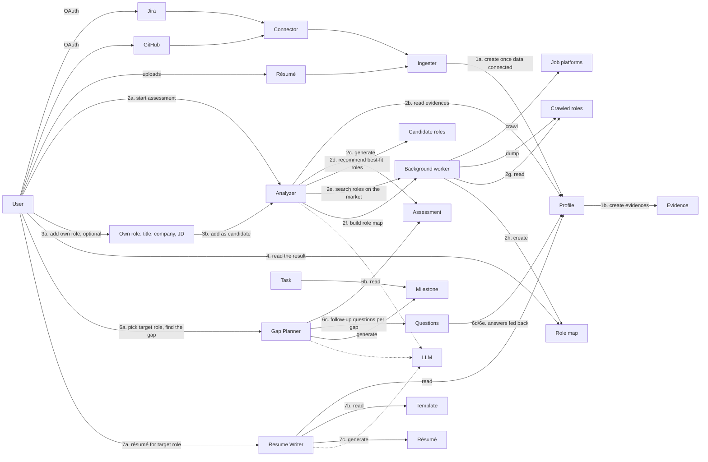
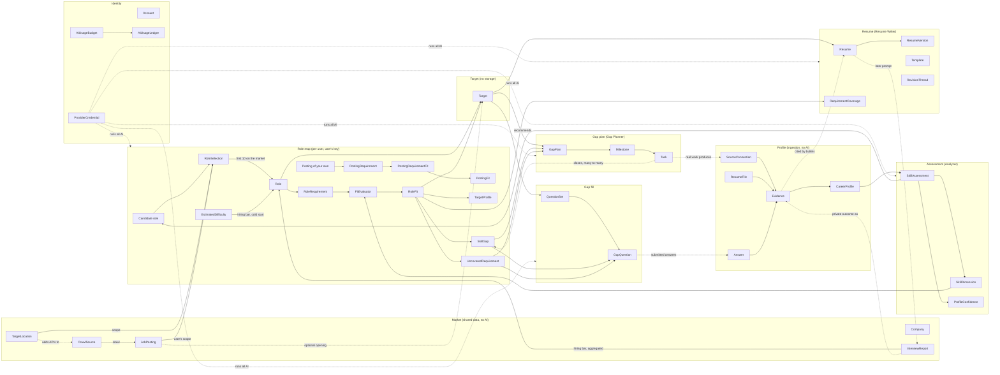
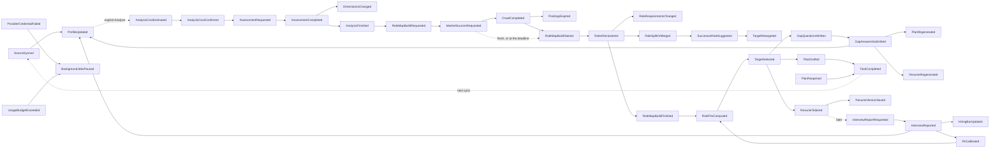

# Domain Model: Job Searching Advisor

A review of the domain concepts in `job_searching_advisor_domain_concepts_v3.excalidraw`, checked against the original product requirements summarized in section 5.1 and the prototype in [`../prototype/`](../prototype/README.md): one screen per file under `screens/`, and its spec, `career-advisor-domain-spec.md`.

Earlier reviews covered v1 (`job_searching_advisor_domain_concepts.excalidraw`) and v2 (`…_v2.excalidraw`). Their decisions still stand unless section 6 marks them superseded. This version reviews v3 and keeps the settled material the model still depends on.

The code follows v3. [`plan.md`](plan.md) Phase 5 records the refactoring steps, and what each left for later.

## 1. What the v3 model says

**What v3 changed from v2**
- **Questions follow the target role, not the radar.** In v2 the Analyzer asked for more evidence when it judged the profile thin (2a/2b). In v3 the Gap Planner writes follow-up questions **per gap between the user and the role they picked** (6c). The answers go back into the Profile as evidence (6d/6e). The Analyzer asks nothing.
- **The role map is built, not picked.** After an assessment, the Analyzer recommends the roles that best fit the user's strengths (2d). The Background worker then searches the market for them and builds the role map (2e–2h). There is no "top k" step for the user to size.
- **The user can add a role of their own** (3a–3e): a title, optionally a company and a JD. It becomes a candidate next to the recommended ones and goes through the same search and build.
- **The Gap Planner and the Resume Writer now have LLM arrows.** This was a v2 finding (2.11).
- **"Resume Advisor" is now "Resume Writer".** In the prototype, "Advisor" names the whole 04 screen: Fill the gap, Gap plan and Résumé.

**What the prototype adds that v3 does not draw**
- **Target locations.** The profile holds 1–3 places the user wants to work. They scope the market search and the salary bands.
- **Profile confidence** moves to 02 Strengths, next to the per-dimension confidence.
- **One target role aims the whole Advisor**, chosen with the role map's single "Advisor target" bar. The Advisor has no picker of its own.
- **The watchlist is gone.** There are no Subscribe buttons, no "Roles to watch", no "Roles to analyse" count and no market filter pills.

## 2. Findings (ordered by impact)

### 2.1 The Advisor aims at one target role
The prototype's Advisor opens every page with a **"Your target role" banner**: the role's title, "at {company} · {location} · {posting}", today's fit, the salary band, and *"Everything on this page is measured against this one role."* The banner has a "Change role" link back to the role map, and there is no other picker. The role map has exactly one control that aims the Advisor, the sticky "Advisor target" bar.

**Decision 26: a Target is one Role, and optionally one opening in it.** This amends decision 16, which allowed three kinds of Target.
- **`Target { role, posting? }`.**
  - `role` is one of the user's Roles. (Until decision 34, recommended or custom, 2.4.)
  - `posting` is an optional shared `JobPosting` inside that Role: a row of the "Top matched openings" list.
  - A subscribed role is no longer a kind of Target, because subscriptions are gone (decision 22).
  - A pasted JD is not a Target of its own either. It belongs to the custom Role it came with.
- **Its requirements come from the most specific thing it has.** This is the `RequirementBasis`, in order:
  1. The posting's own requirements, when the Target has a posting.
  2. The custom Role's private JD, when the Role has one.
  3. Otherwise, the Role's requirements across all its openings.
- **The rest of decision 16 stands.**
  - A Target carries a **frozen snapshot of its requirements** from the moment it is chosen.
  - A **GapPlan** is versioned per Target, and finished tasks carry over to the next version.
  - **Plan history** lists plans across Targets. The prototype shows "Staff Backend Engineer · Northwind Pay — v2" next to "Principal Engineer · Halden Labs — v1 · pasted JD".
  - Task ↔ SkillGap stays many-to-many.
- **The core loop is unchanged, and it is still the point of the product.** Tasks produce real work, the next connector sync brings new Evidence, the user re-assesses, and the plan shows progress. Gap fill (2.8) adds a shorter loop: answering a question is new Evidence today.
- **Role drift** (decision 20): when a Role splits or merges, a Target keeps its snapshot, and the app suggests the successor Role with the most requirement overlap.
- **Where the Target is chosen:** only on the role map. The selection travels to the Advisor as the Role, plus the opening when one was picked.

**Decision 34: a Target can also be a posting of the user's own, chosen in the Advisor** ([ADR 0030](decisions/0030-aim-at-a-posting-of-your-own-instead-of-adding-a-custom-role.md)). This supersedes decision 25 and amends 26.
- **`Target { role, posting? } | { ownPosting }`.** A posting of the user's own is a JD they pasted (title, optional company, the JD itself) to plan for and tailor a résumé to. It is never on the role map, and custom Roles are gone.
- **Its requirements are its JD's**, read once when it is added, and the user's fit is worked out against them. The AI evaluates the requirements once (`PostingRequirementFit`); the **PostingFit** is worked out from that locally, never by an AI call.
- **Where it is chosen:** in the Advisor, which lists the user's postings, adds one at a confirmed cost, and rescores one when the user asks after a new analysis. A Role and its openings are still chosen only on the role map.

### 2.2 The role map is ten roles the system picks, plus the user's own
The prototype's role map reads: *"The 10 best-fit roles on the market, plus the ones you add"* and *"Built after your strength analysis."* The "Roles to analyse" input is gone.

**Decision 23: the system decides how many roles to analyse: ten.** This supersedes decision 17, and will supersede [ADR 0003](decisions/0003-let-the-user-choose-how-many-roles-to-analyse.md) in the PR that changes the code (Phase 5).
- **`RoleSelection`** keeps the first ten of the analysis's candidate roles that the user's market has openings for (decision 29, [ADR 0024](decisions/0024-recommend-roles-from-the-assessment-and-keep-the-ten-the-market-has.md)). The matching runs locally with no AI and costs the user nothing. The cut-off is a fixed 10 instead of a user setting.
- **Why ten, and why fixed:**
  - Every analysed Role costs calls on the user's key, and a fixed number gives a cost the user can predict.
  - A user who wants further afield now adds the role they have in mind (2.4). That targets the spend better than raising k did.
- **What it costs:** a user on a tight budget can no longer analyse fewer than ten, and a user thinking about a career change can't widen the automatic net. Their only option is to add roles one at a time.
- *Superseded by decision 33* ([ADR 0029](decisions/0029-set-the-candidate-count-and-the-top-k-as-settings.md)): the number is still the system's, not the user's, but it is a deployment setting, k (`ROLE_MAP_TOP_K`, default 10). Only the top k are named, analysed and scored. The analysis recommends `ROLE_CANDIDATE_COUNT` candidates (default 10, at most 20), all of them searched for.

**Decision 24: the role map is built after every analysis.** v3's 2d–2h are a single flow: an assessment finishes, and the user's role map is rebuilt from it.
- Pressing Analyze estimates the cost of the analysis **and** of the build together, and asks the user to confirm once. A separate "build the role map" step would have made the user confirm twice for one outcome.
- *Amended by decision 31:* market changes no longer rebuild the map. A map is built only when the user asks, from a market fetched for that build.
- The rules from ADR 0018 hold: an analysis waits for syncs and parses to finish, and a build waits for a running analysis.

**Two lists from one map** (unchanged):
- The **bubble chart** plots the Roles: hiring bar, salary band and fit. (Custom Roles, drawn green until decision 34, are gone.)
- The **Top matched openings** list ranks postings inside those Roles, using RoleFit plus a per-posting adjustment. It has no actions of its own: rows are no longer subscribed to or written for from the list. Picking one only selects it, and the Advisor target bar aims the Advisor at it.
- Role-level and opening-level fit differ on purpose. The prototype's Staff Backend role shows 81%, while its Northwind Pay opening shows 86%.

### 2.3 The background worker must still not produce shared Roles
v3 draws one Background worker that crawls job platforms, dumps "Crawled Roles", and builds the Role Map (2e–2h). The v2 finding still applies:
- **What the crawler produces is `JobPosting`.** The v3 "Crawled Role" is a posting. Postings are shared, and they involve no AI and no user data.
- **Roles are per user** (decisions 2 and 7). A per-user **role-map job** groups the postings in that user's scope into Roles, names them, extracts their requirements and builds the map. It runs on the user's key.
- **A posting of the user's own is private** (decisions 12 and 34). It never feeds the shared crawl, anyone else's Roles, or the user's own role map.

Draw the worker as two units: the crawler (shared) → JobPosting, and the role-map job (per user) → Role → Role map.

### 2.4 Custom roles
*Superseded by decision 34* ([ADR 0030](decisions/0030-aim-at-a-posting-of-your-own-instead-of-adding-a-custom-role.md)): what the user brings is a posting of their own, aimed at from the Advisor (2.1), not a Role. `Role.origin`, custom Roles and the board discovery they drove are gone. The rest of this section records what was built in Phase 5.

The prototype's role map asks *"Not seeing a role you want?"* It takes a **job title (required)**, a **company name (optional)** and a **job description (optional, "sharpens the analysis")**. "Add to Role Map" analyses the role against the user's strengths and places it on the map. *"A pasted JD stays private to you."*

**Decision 25: a user can add their own Roles, which sit beside the ten.**
- A **`Role` has `origin: recommended | custom`.**
  - The top-10 reconciliation never retires a custom Role, and custom Roles don't count toward the ten.
  - The user removes a custom Role explicitly.
- **Finding it on the market (v3 3c):**
  - The role-map job searches the postings in the user's scope for the title, and for the company when one is given.
  - Those postings become the Role's openings, and its hiring bar and salary band come from them, exactly as for a recommended Role.
  - If nothing matches, the Role still appears, with its requirements taken from the JD alone. Its band is marked low-confidence, and its opening count is zero.
- **A named company seeds board discovery.** The crawler looks for a supported ATS board or JSON-LD on that company's careers site (decision 13's discovery, which subscription URLs used to drive). If it finds one, the company becomes a `demand` crawl source with no user id attached. Otherwise nothing is crawled for it, and the JD is all there is.
- **The JD is a `JobPosting` with `visibility: private`**, as before. It belongs to the custom Role it came with and is that Role's requirement basis (2.1).
- **Cost:** adding a Role names nothing, because the user named it. It still extracts requirements and scores fit on the user's key, so "Add to Role Map" shows a cost estimate first.

### 2.5 Market data: permitted sources, target locations, no watchlist
**Decision 21: a user has 1–3 target locations.** This supersedes decision 9. 01 Sources asks *"Where you want to work"*. It has chips, a filterable list of places and a counter ("2 of 3 chosen"). Once three are chosen, the user must remove one before adding another.
- A **`TargetLocation`** is one place from a fixed list: "Remote", a region (a named set of countries) or a country ([ADR 0026](decisions/0026-choose-target-locations-from-a-list-of-countries-regions-and-remote.md)). A country takes in its main cities; a region takes in its member countries and is never searched.
- It replaces **MarketPreference**, the "Markets you are looking in" panel and the role map's filter pills.
- Target locations scope everything market-facing:
  - which postings the role map groups (*"1,284 open postings in Berlin and Remote EU"*)
  - the salary band shown per location
  - which markets' public job APIs are crawled on demand
- With no location chosen, the scope is the baseline alone, as before. The cap of three keeps a first build affordable and the map legible.
- The UI puts target locations in the profile, because the user states them about themselves. The Market context still owns them, because what they decide is market scope (section 3).

**Decision 22: there are no role subscriptions and no match digest.** This supersedes decision 19 and amends decisions 13 and 14. The prototype has no Subscribe button, no watchlist and no "Roles to watch".
- **Removed:**
  - `RoleSubscription`, and the `subscription` kind of Target.
  - The weekly **MatchDigest** and the rate-limited manual re-crawl of a subscribed company.
- **What stays:**
  - Posting expiry and board discovery. Discovery is now driven by companies named on custom Roles (2.4) instead of subscription URLs. (The weekly crawl itself went with decision 31, and discovery with decision 34.)
  - Decision 13's manual fallback is now: a custom Role whose company has no crawlable board runs on its JD. (Since decision 34: a posting of the user's own runs on its JD.)
- **Why:** a watchlist was a second way to aim the Advisor, next to the role map's selection. With exactly one control, the watched role had nothing left to do. A digest with no watchlist would only repeat the role map.
- **What it costs:** nothing tells the user when a company they care about opens a role. They find out by opening the role map.

**Unchanged:**

| Source | Use? | Why |
|---|---|---|
| **Company career pages on public ATS job-board APIs** (Greenhouse, Lever, Ashby, Workable, SmartRecruiters) | **Yes, primary** | Public JSON endpoints meant for syndication; structured fields |
| **Career pages with schema.org `JobPosting` JSON-LD** | **Yes** | Companies publish this markup so search engines index their jobs |
| **Public job APIs / open data** (e.g. Adzuna, Bundesagentur für Arbeit) | **Yes, for market breadth** | Wide coverage per market under published terms |
| **LinkedIn, Indeed, Glassdoor pages** | **No** (decision 6) | Terms of service forbid scraping; LinkedIn has litigated it |

- **Baseline plus demand** (decision 15). `CrawlSource.origin: baseline | demand`. Demand sources now come from the candidate roles searched in the target locations (custom-role companies until decision 34). A source never records who asked for it.
- `CrawlSource { kind: atsBoard | jsonLd | publicApi, origin, company?, market?, endpoint, lastFetchedAt, status }`. Each kind is one adapter behind the anti-corruption layer.
- **Crawler hygiene:**
  - Respect `robots.txt` and rate limits, and identify the user agent.
  - Deduplicate on `JobPosting.canonicalKey`: company + normalized title + location.
- **Fetched when a build needs it** (decision 31, superseding 14):
  - A source is fetched only while a build waits for it, and reused for anyone within its fresh window.
  - `firstSeenAt`, `lastSeenAt` and `status: open | expired`. A board's missing posting expires. A search's fetch replaces its result list instead, and a searched posting counts only while it is on one.
  - An expired posting is kept for salary history. One nothing holds is thinned after a long while, never deleted.
- **Fit is a relationship, not an attribute.** Hiring bar (X) and salary (Y) belong to the Role. Fit (bubble size) belongs to a *User × Role* pair and comes from one `FitEvaluator`.
- **Decision 32: the fit is the Role Map's** ([ADR 0028](decisions/0028-score-the-fit-in-the-role-map.md)). `RoleFit`, its gaps, uncovered requirements and closing lifts, and the ranking of Top matched openings move from the Assessment context to the Role Map context. It is scored against the dimension scores the Analyzer hands over with the candidate roles, so the Role Map still reads nothing from the Assessment. The Assessment describes only the user.

#### Hiring bar = interview difficulty (decisions 5 and 11), unchanged
- **`InterviewReport`** comes from the app's own users, about two weeks after they tailor a résumé.
  - Its shared, anonymized part is aggregated once **at least 3 distinct users** have reported.
  - Its private part becomes the reporter's Evidence and calibrates their fit.
- **`EstimatedDifficulty`** is an AI estimate from postings, run on the user's key and always labelled as an estimate. The dashed outline on the role map marks it.
- **`Role.hiringBar`** blends estimate and reports: `sampleSize`, `confidence`, and `basis: estimated | reported | blended`. Only `estimated` is built so far.

#### Roles are grouped by AI, per user, on the user's key (decisions 2 and 7), unchanged
- **Shared, platform-owned, no AI:** `CrawlSource`, `JobPosting`, `Company`, and aggregated `InterviewReport`s.
- **Per user, on the user's key:** `Role`, `RoleRequirement`, `EstimatedDifficulty` and `RoleFit`.
- Requirements are free text (statement, weight, expected level).
- Role identity survives rebuilds: stable ids, `RoleRenamed` / `RoleSplit` / `RoleMerged`, and lineage.
- Salary bands are per target location. A thin location shows a low-confidence band rather than hiding the Role.

### 2.6 Ingestion stays AI-free, answers included
**Decision 18 stands:** ingestion never calls a model. Connectors, the résumé parser and answers all become Evidence by deterministic rules. Judging what the evidence *means* starts with the Analyzer.

v3 draws the answers going **straight from Questions to the Profile** ("Feedback with answer"). v2 routed them through the Ingester. Keep v2's reading: an answer is one more source (`user_answer`) that the ingestion path turns into Evidence, citing the question it answered. That keeps one way into the Profile, one set of rules about what Evidence looks like, and no AI on the write path.

### 2.7 Evidence, snapshots and confidence
- **Evidence** is `{ source, reference, fact, observedAt }`.
  - `source` is `github | jira | resume | user_answer`. The prototype shows the last as "Your answers" / "Your answer" (it was `self_reported` in the code).
  - **CareerProfile** is the career timeline plus the Evidence set: facts only. Evidence carries no confidence of its own.
- **The Assessment and RoleFit are immutable snapshots.** Each references the profile version and market snapshot it came from, and records the model used.
- **Confidence per dimension** says how sure a score is, as a separate value from the score itself. 02 Strengths lists dimensions "least certain first". It marks thin evidence and points to Sources: *"Connect more sources, like Jira, to add more."*
- **Decision 28: profile confidence belongs to the analysis.** It is one number on the `SkillAssessment` for how well the evidence backs the scores overall, shown next to Re-analyse. It left the shared sidebar, which is not part of any stage.
- **Low confidence no longer raises follow-up questions** (decision 27). It only drives the "thin evidence" hint. More evidence comes from connecting sources, or from answering the questions a target role raises (2.8).

### 2.8 Gap fill: questions come from the target role's gaps
04 Advisor opens on **Fill the gap**, before the Gap plan or the Résumé: *"First: Fill the gap → Then, either: Gap plan | Résumé."* The screen says: *"{model} compared your sources with what this role asks for and wrote a few questions for each gap. Answer what you can, then submit. Anything you skip stays a gap."*

**Decision 27: follow-up questions are written per gap of the Target, and submitted together.** This moves them out of the Analyzer.
- A **`QuestionSet`** belongs to one Target. It is written from the Target's gaps:
  - each `SkillGap` the user is short on (status `partial`)
  - each `UncoveredRequirement` (status `no_evidence`)
  - with each gap's potential fit points, from the fit's own arithmetic
- Each **`GapQuestion`** has:
  - its gap and its text
  - an **"Asked because"** reason
  - an answer type: `choice` (with options), `free_text`, or both
- **Answers are submitted once, together.** A single "Submit answers" button shows how many are answered ("4 of 5 answered") and a cost estimate. Nothing is saved per question, and nothing propagates until the user submits. An unanswered question stays a gap.
- **On submit:**
  1. Each answer becomes Evidence with source `user_answer` (2.6). It appears on Sources under "Your answers" and in "What it found so far".
  2. The Target's gap plan and résumé are regenerated as new versions, if they exist, from the updated evidence and on the user's key.
  3. The plan's provenance says so: *"uses your 4 answers from Fill the gap"*.
- A new Target, or a new analysis that changes the Target's gaps, gets a new QuestionSet. Evidence already submitted stays.
- **Why per gap:** a question about a gap the user is actually trying to close is worth answering, and its answer counts directly toward the plan and the résumé. Questions from a low-confidence radar asked about dimensions the user might not care about, and cost a call on every sync (ADR 0012).
- **What it costs:**
  - Evidence gathered this way is tied to one role's vocabulary.
  - A user who never targets a role is never asked anything.
  - Answering needs a Target first, so the journey's forward-only rule holds: Sources never asks a question.

### 2.9 Resume Writer
v3's Resume Writer reads the Profile and the Template (7a–7c). Writing *for a role* also needs:
- **The Target** (2.1) and its requirements snapshot. v3 draws the user's choice (7a) but no box holds it.
- **The Assessment.** `RequirementCoverage` is decided from the user's scores against the Target, not by the model, so the Writer reads scores as well as Evidence. Add the arrow.
- **The base ResumeFile** when one was uploaded ("revised rather than replaced").
- **The answers from Fill the gap**, which arrive as Evidence: *"Drafted from your sources, including the 4 answers you gave in Fill the gap."*

The rest is unchanged:
- **`RequirementCoverage { requirement, verdict: covered | partial | gap, evidenceRefs }`**, shown as "Their requirements → your evidence".
- **Every generated bullet cites Evidence.** A bullet with none is rejected.
- **Versions:** `ResumeVersion`, listed as "Saved résumés" per Target and company. Manual edits and the `RevisionThread` chat both produce versions, and a chat proposal applies only when the user says so.
- **Export is presentation:** the Template (the prototype shows Organic and Plain), a white page, and PDF.

### 2.10 Cross-cutting concerns to keep out of the core
- **`Account` vs `SourceConnection`**: login and connector OAuth use different tokens, scopes and revoke rules.
  - Sign-in is our own email and password ([ADR 0001](decisions/0001-run-our-own-email-password-sign-in.md)), or Google ([ADR 0008](decisions/0008-sign-in-with-google-by-our-own-oidc-exchange.md)).
- **`ProviderCredential` is stored encrypted on the server** (decision 3) and is write-only.
- **Background jobs spend the user's money.**
  - `AIUsageBudget` (monthly cap) and `AIUsageLedger` (per call).
  - A job that would exceed the cap pauses instead of running.
- **Keys fail.** Emit `ProviderCredentialFailed`, pause that user's scheduled jobs, and say so.
- **Record the model on every AI-derived snapshot:** SkillAssessment, RoleFit, QuestionSet, GapPlan, ResumeVersion.
- **Show cost before spending.** Every AI action the user starts shows an estimate on their key first:
  - Analyze, which now includes the role-map build
  - Add to Role Map
  - Submit answers
  - Generate gap plan
  - writing a résumé
  - Later automatic runs (a market-driven rebuild) happen within the budget.

### 2.11 Smaller diagram issues
- **Spelling:** "Analyzor" → Analyzer, and "Resume Writter" → Resume Writer.
- **Duplicate and stale labels:**
  - "6e" is used twice: once for feeding answers back, once for Gap Planner → Milestone.
  - "3c" labels two steps.
  - "Resume Writer → Profile" still carries v2's "10a".
  - "2g read / 3d …" and "2h create / 3e …" leave the custom-role branch unfinished.
- **Task → Milestone** still points from task to milestone. A Milestone contains Tasks, and a Task links to the SkillGaps it closes.
- **The Target is drawn as a user action (6a, 7a), not a box.** Add a Target box between the Role map and both the Gap Planner and the Resume Writer. The QuestionSet hangs off it.
- **Missing:**
  - Target locations on the Profile, which feed the Background worker's search.
  - ProviderCredential and budget, which every LLM arrow depends on.
  - Resume Writer → Assessment (2.9).
- **The Job Platform boxes** should read ATS boards / JSON-LD pages / public job APIs.

### 2.12 Where the original requirements and prototype drift from the model
| Where | Says | Model |
|---|---|---|
| Original requirements: Role Map | "User can decide the number of k by themself" | k, a deployment setting (decision 33); postings of the user's own in the Advisor (decision 34) |
| Original requirements: Follow Up Questions, AI | Questions after profile analysis when the context isn't enough | Questions per gap of the Target, in the Advisor (decision 27) |
| Original requirements: Background worker | Glassdoor, LinkedIn, Indeed; "User active subscribe for the company jobs" | Not crawled (decision 6); no subscriptions (decision 22) |
| Original requirements: User Login | Google OAuth or own account | Both (ADR 0001, ADR 0008) |
| prototype `Model.dc.html` "What runs on your key" | Follow-up questions are "written when the evidence leaves a score uncertain" | Written per gap of the target role (decision 27) |
| prototype `Model.dc.html` | Provider toggle: Anthropic or OpenAI | The gateway also supports Google and any OpenAI-compatible base URL |
| prototype `Roles.dc.html` vs `Gaps.dc.html` | 81% fit and 160–196k on the role; 86% and 165–190k in the Advisor | Correct: role fit versus opening fit (2.2). The Advisor shows the opening's, because the Target has one. |

## 3. Proposed bounded contexts

- **`Target`** is a value, not a table: a Role, an optional opening, and the frozen requirements snapshot. It has its own context because the question set, the plan and the résumé all aim at one, and none of them may own it ([ADR 0005](decisions/0005-resolve-targets-in-their-own-module.md)).
- **Gap fill** is its own context too. The plan and the résumé both regenerate from its answers, and its questions depend on the Target and the fit, not on either consumer.
- **`TargetLocation`** is shown in the profile but owned by Market, because what it decides is market scope.

**Cardinality at a glance**
- Account 1 — 1 CareerProfile, 1 — 1 ProviderCredential, 1 — * SkillAssessment (history)
- SkillAssessment 1 — 5..10 SkillDimension (per user; ids stable across assessments), 1 — 1 profile confidence
- Account 1 — 0..3 TargetLocation
- CrawlSource 1 — * JobPosting; JobPosting is shared by all users (except private ones)
- Account 1 — ≤k Role; Role * — * JobPosting; Role 1 — * RoleRequirement
- Account 1 — * posting of your own (a private JobPosting); each 1 — * PostingRequirement, 1 — 0..1 current PostingFit
- Account × Role → 0..1 current RoleFit (plus history)
- Target 1 — * QuestionSet (one current); QuestionSet 1 — * GapQuestion; GapQuestion 1 — 0..1 Answer
- Target 1 — * GapPlan (versions); Account 1 — * GapPlan (plan history across Targets)
- Task * — * SkillGap
- Target 1 — * Resume; Resume 1 — * ResumeVersion; Account 1 — * InterviewReport

### Key domain events

## 4. Glossary

| Term | Definition | Context |
|---|---|---|
| Account | A person using the app; signs in with their own email and password, with Google, or both | Identity |
| ProviderCredential | The user's AI provider, model, base URL and API key; stored encrypted on the server, never readable by the client; the only AI credential in the system | Identity |
| AIUsageBudget / AIUsageLedger | User-set monthly spending cap for AI on their key, and the per-call record checked against it | Identity |
| Ingester | The process that turns connector data, uploaded résumés and submitted answers into Evidence, with deterministic rules and no AI | Profile |
| SourceConnection | An authorized link to GitHub, Jira, LinkedIn, or a personal-site URL; has scopes and sync state | Profile |
| ResumeFile | An uploaded résumé (PDF/DOCX); parsed into Evidence and usable as a revision base | Profile |
| Evidence | One cited fact about the user's work (source, reference, fact, date); source is `github`, `jira`, `resume` or `user_answer` | Profile |
| Answer | The user's submitted reply to a GapQuestion, stored as Evidence with source `user_answer` ("Your answers") | Profile |
| CareerProfile | Career timeline plus all Evidence for one user; facts only, one per user | Profile |
| TargetLocation | One of the user's 1–3 places to work, picked from a list: Remote, a region or a country (ADR 0026); scopes the role map, the salary bands and demand crawling. Shown in the profile, owned by Market. Replaces MarketPreference | Market |
| CrawlSource | A crawlable source that permits it (public ATS job board, career page with JSON-LD, or a search of a public job API for one job title in one place); `origin` is `baseline` (platform-curated) or `demand` (a candidate role's search in a target location asked for it), never who asked | Market |
| JobPosting | One normalized opening, deduplicated by company + title + location. Crawled postings are shared; a posting of the user's own is private to its owner. Tracks first/last seen and open/expired | Market |
| Company | An employer seen in the market | Market |
| InterviewReport | A user's report of an interview. The shared part is aggregated for the hiring bar when ≥3 users reported; the private part becomes the reporter's Evidence and calibrates their fit | Market |
| RoleSelection | The local, no-AI matching that keeps the first ten candidate roles with openings in the user's scope, in the analysis's order | Role map |
| Role | A candidate role found on the market, named from the postings in *one user's* scope that are its openings, with what they ask for; stable id and lineage, hiring bar, salary bands per target location, opening count. Nothing in it is about the user | Role map |
| Posting of your own | A JD the user pasted (title, optional company) to aim the Advisor at; never on the role map. Its requirements are read once, the AI evaluates them once (PostingRequirementFit), and its PostingFit is worked out from that locally (decision 34). Replaces the custom Role | Role map |
| PostingFit | The user's fit to one posting, worked out locally from an AI fit; never an AI call | Role map |
| Candidate role | A role the latest SkillAssessment recommended from the user's strengths, best fit first: the query a build searches the market and matches postings with (ADR 0024) | Role map |
| CandidatePlacement | One build's record of what it made of one candidate role: placed on a Role, outside the top k, or too few openings, with its opening count and local fit estimate (ADR 0031) | Role map |
| RoleRequirement | A skill requirement pulled from a Role's postings or its private JD (statement, weight, expected level); has no dimension | Role map |
| EstimatedDifficulty | AI estimate of interview difficulty from posting content, used until enough InterviewReports exist | Role map |
| Hiring bar | A Role's interview difficulty (bubble chart X axis); blends estimate and reports, with sample size, confidence and basis | Role map |
| Analyzer | The process that produces the SkillAssessment from Evidence, hands its candidate roles and scores to the Role Map, and triggers the role-map build; the first step after ingestion that calls the LLM | Assessment |
| SkillDimension | One axis of *this user's* skills (5–10 per user), defined by their profile analysis; its id stays stable across re-assessments | Assessment |
| SkillAssessment | Snapshot of per-dimension scores and confidence for a Profile version (radar), plus profile confidence; records the model used | Assessment |
| Profile confidence | How well the evidence backs the scores overall; one number on the SkillAssessment, shown on 02 Strengths | Assessment |
| FitEvaluator | Domain service that maps requirements onto a user's dimensions and scores fit, for a Role, a posting or a private JD | Assessment |
| TargetProfile | Target score per user dimension for one Role or Target, produced by that mapping | Assessment |
| RoleFit | Snapshot of fit between a user and a Role (bubble size, list rank), with TargetProfile and reasoning, scored against the scores the Analyzer handed over (decision 32) | Role Map |
| SkillGap | User's score minus the target score on one dimension | Assessment |
| UncoveredRequirement | A requirement that matches none of the user's dimensions, meaning there is no evidence at all | Assessment |
| Target | What the Advisor aims at: one Role and optionally one opening in it, with a frozen snapshot of its requirements | Target |
| Advisor | The 04 screen: Fill the gap first, then either the Gap plan or the Résumé, all measured against one Target | (UI) |
| Gap fill | The Advisor's first step: questions per gap of the Target, answered and submitted together | Gap fill |
| QuestionSet | The follow-up questions written for one Target's gaps; records the model used | Gap fill |
| GapQuestion | One question about one gap, with an "asked because" reason and a choice and/or free-text answer | Gap fill |
| Gap Planner | The process that drafts a GapPlan for a Target from the user's gaps | Gap plan |
| GapPlan | A plan to close one Target's gaps, with Milestones and Tasks; regenerating makes a new version; plans across Targets form the plan history | Gap plan |
| Milestone / Task | A time-boxed outcome and the concrete actions under it; a Task can close gaps in several plans | Gap plan |
| Resume Writer | The process that writes and revises a résumé for a Target from the user's Evidence. v2 called it the Resume Advisor | Resume |
| RequirementCoverage | For each of a Target's requirements: covered, partial or gap, with the Evidence that backs it | Resume |
| Resume | A structured, editable résumé aimed at one Target; each bullet cites Evidence | Resume |
| ResumeVersion | A saved state of a Resume that can be reopened; records the model used | Resume |
| Template | Visual layout used when exporting (white page) | Resume |
| RevisionThread | The AI chat that proposes edits to a Resume, applied only on the user's say-so | Resume |

**Removed in this version:** RoleSubscription (decision 22), MarketPreference (replaced by TargetLocation, decision 21), MatchDigest (decision 22), FollowUpQuestion in its v2 sense (replaced by GapQuestion, decision 27), and the user's k (decision 23).

## 5. Traceability

### 5.1 Original product requirements → concepts

This summary preserves the original requirements and records how the model evolved.
The current model and decisions govern implementation.

| Original requirement | Concepts |
|---|---|
| **Profile Analysis:** Jira, GitHub, LinkedIn (OAuth), personal website | SourceConnection → Ingester → Evidence |
| Follow-up questions to complete the evidence | **Changed:** GapQuestion per gap of the Target → Answer → Evidence (decision 27) |
| Analyze experience and career trajectory | CareerProfile (timeline + Evidence) |
| **Assessment:** skill strength radar; dimensions decided by profile analysis | SkillAssessment over the user's own 5–10 SkillDimensions, with per-dimension and profile confidence |
| Bubble chart: size = fit, X = hiring bar, Y = salary, one bubble per role | Role (hiring bar, salary band) + RoleFit |
| **Background worker:** Glassdoor / LinkedIn / Indeed | **Changed:** not crawled (decision 6). Permitted sources only. LinkedIn stays a Profile connector. |
| User subscribes to company jobs | **Changed:** removed (decision 22). Nothing seeds a company's board since decision 34. |
| Fetched system wide | Shared JobPosting pool from a baseline crawl plus demand sources (decision 15) |
| User-uploaded JD | A posting of the user's own: a private JobPosting the Advisor aims at, its own requirement basis (decision 34) |
| **Role Map:** top k similar roles from assessment and profile | Candidate roles from the SkillAssessment → RoleSelection (the first ten the market has), built after each analysis → RoleFit; Top matched openings in those Roles |
| User decides k | **Changed:** k, a deployment setting (decision 33); a job the map misses is brought as a posting of the user's own (decision 34) |
| **Gap Plan:** generated for the role the user selected | Target → GapPlan → Milestone → Task, from SkillGap + UncoveredRequirement and the submitted answers |
| Gap plan history can be revisited | GapPlan versions per Target; plan history across Targets |
| **Resume Advisor:** generate for a role from the bubble chart or typed in | Resume for a Target: a Role on the map, or a posting of the user's own pasted in the Advisor (decision 34) |
| AI writes from evidence to fit the role; first version customized to the role | RequirementCoverage + Evidence-cited bullets; first ResumeVersion written for the Target |
| Manual edit; chat with AI to improve | ResumeVersion, RevisionThread |
| Save / reopen résumés | ResumeVersion, "Saved résumés" per Target |
| Default white background | Template (rendering, not domain) |
| **User Login:** Google OAuth or own account | Account, with a PasswordCredential and/or a FederatedIdentity |
| **AI:** user configures provider and key | ProviderCredential, AIUsageBudget |
| AI for questions, profile and market analysis, résumé, gap plan | GapQuestion, SkillAssessment (with its candidate roles), Role naming, FitEvaluator, GapPlan, RevisionThread — all on the user's key. Ingestion does not use AI (decision 18). |

### 5.2 Prototype screens → concepts

| Screen | What it shows | Concepts |
|---|---|---|
| `Sidebar.dc.html` | 01 Sources · 02 Strengths · 03 Role map · 04 Advisor, then System configuration → AI & model; no badges, no confidence meter | The forward-only journey; profile confidence moved to Strengths (decision 28) |
| `Main.dc.html` — 01 Sources | "Where you want to work" (up to 3, "2 of 3 chosen") | TargetLocation (decision 21) |
| | GitHub and Jira cards (connect, sync, disconnect), résumé upload and "Analyze with AI" | SourceConnection, ResumeFile, the explicit Analyze request |
| | "What it found so far" (GitHub / Résumé / Your answers), "Where the work lives", evidence table filterable by source | Evidence by source, including `user_answer`; tallies by repository and epic (ADRs 0016, 0017) |
| `Strengths.dc.html` — 02 Strengths | Radar, "Least certain first" list with per-dimension confidence, thin-evidence note pointing to Sources, cited facts, Profile confidence next to Re-analyse | SkillAssessment, SkillDimension, confidence per dimension, profile confidence; no role fit |
| `Roles.dc.html` — 03 Role map | "The 10 best-fit roles on the market, plus the ones you add", "Built after your strength analysis", postings counted in the target locations | RoleSelection (decisions 23, 24), TargetLocation scope |
| | Bubble chart; dashed = estimated bar | Role, RoleFit, EstimatedDifficulty |
| | Selected role: fit, band, openings, how you fit each dimension (you against what the role asks), "No evidence at all for these", what the role asks for | RoleFit, SkillGap, UncoveredRequirement, RoleRequirement |
| | Top matched openings (rank, fit, title · company, band, posting, location) | JobPosting inside a Role, per-posting fit |
| | "Add a role of your own" moved to the Advisor as "Aim at a posting of your own" (decision 34) | Posting of your own, PostingFit |
| | Sticky "Advisor target" bar, "Target this role" | The only way a Target is chosen (decision 26) |
| `Gaps.dc.html` — Fill the gap | Target banner; gap cards (Partial / No evidence, "up to +N fit pts"); questions with "Asked because" and choice / free text; "4 of 5 answered", cost, one "Submit answers" | Target, QuestionSet, GapQuestion, SkillGap / UncoveredRequirement, Answer → `user_answer` Evidence (decision 27) |
| `Plan.dc.html` — Gap plan | "Generate gap plan", Plan history (per role · company, version), provenance "uses your 4 answers", ranked gaps with citations, stepping stones, milestones and tasks with progress, projects that prove it | GapPlan versions per Target, plan history, Milestone, Task; stepping stones are higher-fit Roles near the Target's |
| `Resume.dc.html` — Résumé | "Write for" the Target; Saved résumés per company; Template (Organic, Plain); Export PDF; résumé with cited lines; "Save as v4"; "Their requirements → your evidence"; "Revise with {model}" (Apply / Discard) | Resume, ResumeVersion, Template, RequirementCoverage, RevisionThread |
| `Model.dc.html` — AI & model | Provider, model, write-only key ("····a91f"), what runs on your key, monthly budget | ProviderCredential, AIUsageBudget / AIUsageLedger |

## 6. Decisions and remaining questions

### 6.1 Decisions

An accepted decision is not rewritten. A changed mind is a new row that supersedes the old one.

| # | Date | Question | Decision | Where it changed the model |
|---|---|---|---|---|
| 1 | 2026-09-14 | Skill taxonomy | **Different per user** | FitEvaluator mapping, TargetProfile, UncoveredRequirement, stable dimension ids |
| 2 | 2026-09-14 | Role catalog | **Grouped by AI from postings** — *Superseded by 29* | 2.5: RoleRequirement, stable Role ids with lineage |
| 3 | 2026-09-14 | API key location | **Stored encrypted on the server** | 2.10: write-only ProviderCredential, usage budget and ledger, failure handling |
| 4 | 2026-09-14 | Multiple goals | **Yes** — *Superseded by 16* | CareerGoal with status and priority; removed |
| 5 | 2026-09-14 | Hiring bar source | **Interview difficulty** | 2.5: InterviewReport + EstimatedDifficulty blend |
| 6 | 2026-09-14 | Market data source | **In-house crawler**, limited to sources that permit it; no scraping of LinkedIn, Indeed or Glassdoor | 2.5: CrawlSource, dedup key |
| 7 | 2026-09-14 | Who pays for shared AI work | **The user** | 2.5 / 2.10: Role naming per user on the user's key; no platform AI credential |
| 8 | 2026-09-14 | Dimension count | **Bounded, 5–10** | Merge above 10; below 5, say the evidence is thin rather than invent dimensions |
| 9 | 2026-09-14 | Launch markets | **User selects** — *Superseded by 21* | MarketPreference; replaced by TargetLocation |
| 10 | 2026-09-14 | Goal when its role splits | **App suggests a successor** — *amended by 20* | 2.1 |
| 11 | 2026-09-14 | Interview-report incentive | **More accurate analysis for the reporter** | 2.5: private outcome becomes Evidence; shared part aggregated at ≥ 3 reporters |
| 12 | 2026-09-14 | Pasted JDs | **Private to their owner** | 2.4 / 2.5: `JobPosting.visibility`; a custom Role's JD, now a posting of the user's own (34) |
| 13 | 2026-09-14 | Uncrawlable companies | **Manual fallback (paste JDs)** — *amended by 22* | 2.4: a custom Role whose company has no crawlable board runs on its JD |
| 14 | 2026-09-14 | Crawl frequency | **Weekly** — *amended by 22* (no digest, no manual re-crawl); *superseded by 31* | 2.5: posting expiry |
| 15 | 2026-09-22 | What "fetched system wide" means | **A platform-curated baseline crawl alongside demand-driven crawling** | 2.5: `CrawlSource.origin`; platform pays for the baseline |
| 16 | 2026-09-22 | What a gap plan aims at | **A Target (matched posting, subscribed role or pasted JD); no CareerGoal; plan history per Target** — *amended by 26* | 2.1: Target, GapPlan versions; supersedes 4 |
| 17 | 2026-09-22 | Who sets k on the role map | **The user, within a bound** — *Superseded by 23* | RoleSelection setting; removed |
| 18 | 2026-09-22 | Does ingestion use AI | **No** | 2.6: the Ingester is deterministic, answers included |
| 19 | 2026-09-22 | What a subscription is to | **A role at a company, with an optional careers or JD URL** — *Superseded by 22* | RoleSubscription; removed |
| 20 | 2026-09-22 | Target when its role splits | **App suggests a successor; the Target keeps its snapshot until the user accepts** | 2.1: amends 10 now that goals are gone |
| 21 | 2026-09-29 | Where the user wants to work | **1–3 target locations, set in the profile; they scope the role map, salary bands and demand crawling** — *amended by ADR 0026: picked from a list of Remote, regions and countries* | 2.5: TargetLocation replaces MarketPreference; supersedes 9 |
| 22 | 2026-09-29 | Watching roles and companies | **No subscriptions and no match digest; a custom Role's company seeds board discovery** — *amended by 34: no discovery* | 2.4 / 2.5: RoleSubscription and MatchDigest removed; supersedes 19, amends 13 and 14 |
| 23 | 2026-09-29 | How many roles the map analyses | **Ten, decided by the system** | 2.2: RoleSelection has a fixed cut-off; supersedes 17 (and ADR 0003 when built) |
| 24 | 2026-09-29 | When the role map is built | **After every analysis, confirmed with the analysis's cost estimate; market changes still rebuild it** — *amended by 31: only when asked* | 2.2 |
| 25 | 2026-09-29 | Roles the recommendation misses | **The user adds a custom Role (title required; company and a private JD optional), searched on the market and placed beside the ten** — *Superseded by 34* | 2.4: `Role.origin`; the JD is the Role's requirement basis |
| 26 | 2026-09-29 | What the Advisor aims at | **One Target: a Role (recommended or custom) and optionally an opening in it, chosen only on the role map** — *amended by 34* | 2.1: amends 16; the subscription and pasted-JD kinds are gone |
| 27 | 2026-09-29 | Where follow-up questions come from | **Per gap of the Target, in the Advisor's first step, answered and submitted together; answers become `user_answer` Evidence and regenerate the plan and résumé** | 2.8: Gap fill; the Analyzer no longer asks questions |
| 28 | 2026-09-29 | Where profile confidence lives | **On the SkillAssessment, shown on 02 Strengths** | 2.7 |
| 29 | 2026-09-30 | Where the recommended Roles come from | **The analysis recommends candidate roles from the strengths; the role map keeps the first ten the user's market has openings for, and fits are scored once per build** | 2.2: RoleCandidate, RoleSelection; supersedes 2 ([ADR 0024](decisions/0024-recommend-roles-from-the-assessment-and-keep-the-ten-the-market-has.md)) |
| 30 | 2026-09-30 | How a candidate role's openings are found | **Its title is searched on a public job API (Himalayas) for the countries and remote work the user named, as ownerless demand sources; on-site work stays on company boards** | 2.5: CrawlSource as a search; remote work open worldwide is in every searchable target location ([ADR 0025](decisions/0025-search-himalayas-for-the-candidate-roles.md)) |
| 31 | 2026-10-02 | When the market is fetched, and the map built | **Only when the user asks for a build: it asks for the sources it reads, waits for the stale ones, and the ten are chosen by a free local fit estimate; nothing the market does builds a map, and nothing reads across users** | 2.5: supersedes 14, amends 24 ([ADR 0027](decisions/0027-fetch-the-market-only-when-a-build-needs-it.md)) |
| 32 | 2026-10-03 | Where the fit lives | **In the Role Map, scored against the dimension scores the Analyzer hands over with the candidate roles; the Assessment describes only the user** | 2.5: moves RoleFit, SkillGap, UncoveredRequirement and the Top matched ranking from Assessment to Role Map ([ADR 0028](decisions/0028-score-the-fit-in-the-role-map.md)) |
| 33 | 2026-10-03 | How many roles a build keeps, and how many an analysis recommends | **Both are deployment settings: the top k (default 10) are named, analysed and scored, of the candidates an analysis recommends (default 10); custom roles are on top** | 2.2: supersedes 23 ([ADR 0029](decisions/0029-set-the-candidate-count-and-the-top-k-as-settings.md)) |
| 34 | 2026-10-04 | What a user brings of their own | **A posting of their own (title, optional company, JD required), aimed at from the Advisor and never on the role map; its fit is worked out locally from one AI evaluation of its JD** | 2.1: supersedes 25, amends 22 and 26; custom Roles and board discovery go ([ADR 0030](decisions/0030-aim-at-a-posting-of-your-own-instead-of-adding-a-custom-role.md)) |

### 6.2 Remaining questions

These are the defaults chosen for this update. Change them if they don't fit.
- **Profile confidence:** the mean of the dimensions' confidence, unweighted. Weighting by how much each dimension matters would need a role, and Strengths shows none.
- **Resubmitting answers:** submitting again adds new Evidence and keeps the old. An answer is a fact the user stated at a point in time, like any other.
- **Removing a posting of your own:** its JD goes with it; its plans and résumés keep their snapshots, like a Target whose Role retired.
- **Baseline list:** a short list kept in the repo, reviewed like code.
- **Plan history retention:** keep every plan, most recent first.
- **Minimum group size for shared difficulty:** 3 distinct reporters.
- **Expired postings:** kept for salary-band history, hidden from lists.

**Suggested next step:** apply 2.11 to the v3 diagram: add a Target box, add Resume Writer → Assessment, route answers through the Ingester, and fix the labels. Update the prototype copy listed in 2.12. The code changes are [`plan.md`](plan.md) Phase 5.

**Architecture:** deployable units, module dependencies, data and trust boundaries are in [`architecture.md`](architecture.md).
