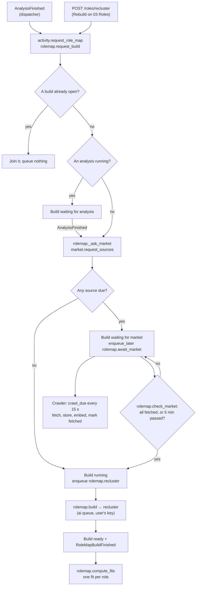

# Role-map build process

A role-map build turns the analysis's candidate roles into the role map on
03 Roles. It keeps the top k the market has that read most like the user's
strengths (k is `ROLE_MAP_TOP_K`, 10 by default, ADR 0029), analyses each
one's requirements and hiring bar on the user's key. Fits are then scored once
per build, for those k only. A posting the user brings themselves is never on
the map, and no build reads or scores it (ADR 0030).

The market is fetched only when a build needs it (ADR 0027). So a build first
asks the market for the sources it reads, waits while stale ones are fetched,
then runs on what is stored.

## Overview

## 1. What asks for a build

| Trigger | Path | Cost confirmed by |
|---|---|---|
| A finished analysis | The dispatcher routes `AnalysisFinished` to `activity.build_after_analysis`, then `wiring.queue.queue_build` | The analysis's estimate, which includes the build and fits (ADR 0020) |
| Rebuild on 03 Roles | `POST /roles/recluster`, then `_request_build`, then `activity.request_role_map`, then `queue_build` | `GET /roles/cost-estimate` |

Nothing else builds. A change of target locations emits
`TargetLocationsChanged`, which queues nothing, because a build spends the
user's key. Instead the map reports that its locations changed (section 7).
There is no scheduled rebuild.

### Pricing

`rolemap.estimate_cost` is a ceiling, because the api runs no embeddings:

- **Roles counted:**
  - `max_role_count(postings in scope, ceiling=k)`, which is one role per 3
    postings, capped at k;
  - the full k whenever the user has a searchable place, because the search
    that runs first could find anything;
  - and no build cost at all when that comes to 0 roles.
- **Calls per role:** two, `role_extraction` and `difficulty_estimate`, each
  priced on the costliest prompt the postings could fill.
- **Fits:** `rolemap.estimate_fits` adds one `fit_projection` per
  recommended role.

## 2. Record the build (`rolemap.request_build`)

One build is open (`waiting` or `running`) per user at a time:

- **A build lost past `JOB_STALE_AFTER_SECONDS`:** `activity` closes it as
  `stale` first. A waiting build's age counts from when it asked the market,
  or else from when it was requested.
- **A build is already open:** the request returns it, and nothing is
  queued. The exception is a build that waited for an analysis that has now
  ended: it goes on to ask the market.
- **An analysis is running** (`activity`'s rule, ADR 0018): a new build is
  recorded `waiting` and asks nothing yet. When `AnalysisFinished` arrives,
  `build_after_analysis` continues it: through `request_role_map` after a
  success, or `release_waiting` after a failure.
- **Otherwise:** a new build is recorded, and it asks the market at once.

`BuildRequestView` tells the caller what to queue. `queue_build` acts on it:
`should_queue` enqueues `rolemap.recluster` (on the `ai` queue), and
`should_await_market` schedules `rolemap.await_market` (on the `sync` queue)
after `CRAWL_DUE_POLL_SECONDS`.

## 3. Ask the market (`rolemap._ask_market`)

Only job titles, places and company ids cross into `market`, never who asked:

| `rolemap` sends | `market.request_sources` turns it into |
|---|---|
| The current candidates' titles | One `himalayas` search source per title for each place a search covers: a country or "Remote". A region or city adds none. Missing ones are created ownerless with `create_if_absent` (`ON CONFLICT DO NOTHING`). |
| The user's target locations | The places above, also recorded on the build as `locations` |
| — | Every active baseline board |

**Freshness:** every source is marked as asked for (`last_requested_at`). A
source is **due** (`due_at` set) if it was never fetched, or if it was last
fetched longer ago than its window: 72 h for a search
(`MARKET_SEARCH_FRESH_HOURS`), 24 h for a board (`MARKET_BOARD_FRESH_HOURS`).

- **A retired search** is reactivated and fetched afresh.
- **Marking is idempotent:** two builds that need the same stale source wait
  on one fetch.

**What the build records:**
- the source ids it needs (`needed_source_ids`) and waits for
  (`awaited_source_ids`);
- the target locations it was built for;
- when it asked the market (`awaited_since`).

If nothing is due, the build starts at once. Otherwise it stays `waiting`,
with `waiting_for = "market"`.

## 4. Fetch what is due (crawler)

The crawler holds no secrets and no grant on any user schema. Every
`CRAWL_DUE_POLL_SECONDS` (default 15), `crawl_due` takes every active, due
source:

1. **Admission** (`CrawlPoliteness`):
   - robots.txt, cached for 24 h;
   - a per-host rate limiter;
   - the `HostGuard`: a 429 or 403 pauses the host, for `Retry-After` or else
     a backoff starting at 15 min and doubling up to 6 h. There is also a
     ceiling of `CRAWL_MAX_REQUESTS_PER_HOST_PER_DAY` requests per host.

   A held-back host raises `RateLimitedError`, and its sources **stay due**
   for the next pass.
2. **Fetch and store** (`CrawlIngest.record_crawl`):
   - **A board** lists everything its company has, so its postings are
     upserted and the ones it no longer lists are expired.
   - **A search** shows one page, so its postings are upserted and its
     `market.search_result` list is *replaced*. Nothing is expired: a job
     missing from the page was usually pushed off it, not closed.
   - **A failed fetch** is recorded on the source, and still counts as
     fetched, so the build goes on without it.
3. **Embed** new postings locally (`all-MiniLM-L6-v2`).
4. **Mark fetched** (`mark_fetched` clears `due_at`), and only now, so a
   build that starts finds the postings' vectors.

A daily sweep keeps idle data small:
- searches nobody asked for in `MARKET_SOURCE_IDLE_DAYS` are retired and
  their result lists emptied;
- postings nothing holds that went unseen for `POSTING_THIN_AFTER_DAYS` are
  thinned (description and embedding dropped).

## 5. Wait for the market (`rolemap.await_market`)

The job runs on the `sync` queue as the build's owner. Each waiting build
checks only its own sources, so nothing reads across users.
`rolemap.check_market` returns one of:

| Result | When | Then |
|---|---|---|
| `START` | None of `awaited_source_ids` is still due, or `MARKET_WAIT_SECONDS` (default 300) have passed since `awaited_since` | The build is marked `running`, and `rolemap.recluster` is enqueued |
| `WAIT` | Sources are still due, before the deadline | `await_market` schedules itself again after `CRAWL_DUE_POLL_SECONDS` |
| `DONE` | The build is no longer waiting for the market (it already started, failed or closed) | Nothing |

At the deadline, the build runs on whatever is stored.
`MARKET_WAIT_SECONDS` must be less than `JOB_STALE_AFTER_SECONDS`, so a
waiting build is never counted as lost before its deadline.

## 6. The build (`rolemap.build` → `recluster`)

`rolemap.jobs.recluster` runs on the `ai` queue and calls `rolemap.build`. A
build that is no longer `running` is skipped.

### 6.1 Recommended roles (`_build_recommended`)

Skipped when there are no candidates, meaning no analysis has succeeded yet;
then nothing is placed. Every step below is local and free until
step 6:

1. **Scope.** The open postings in the user's places, with their vectors.
   Postings the crawler hasn't embedded yet are embedded here.
   - Board postings count while they are open.
   - A searched posting counts only while it is on a current search result
     list.
   - A user with no location gets the baseline postings.
   - With fewer than 3 postings in scope, the build stops here and keeps the
     map as it is.
2. **Assign** (`assign_postings`). Each posting becomes an opening for at most
   one candidate, so the kept roles never share an opening:
   - **found by a search:** it goes to the nearest candidate whose own
     search found it, if the posting is relevant to that candidate (it names
     every word of the title, or its cosine is at least 0.40). Otherwise it
     is dropped.
   - **any other posting:** it goes to the nearest candidate whose every
     title word it names, else to the nearest candidate at a cosine of at
     least 0.40.
3. **Eligible** (`keep_on_market`). Candidates with at least 3 openings.
4. **Estimate** (`fit_estimates`), with no AI:
   - Each dimension's name and read is embedded, and weighted by
     `score / 100 × confidence` from the `CandidateStrength` rows.
   - Each eligible candidate is the centroid of its openings.
   - A dimension's similarity to a role is centred on that dimension's mean
     across every role, so a broad dimension lifts none of them.
   - Dimensions the candidate rests on count fully; the rest count 0.25.
5. **Choose** (`choose_by_estimate`). The k eligible candidates with the
   best estimate, ties broken by the analysis's order. Nothing below is spent
   on the rest: they are recorded unplaced in step 8.
6. **Reconcile and analyse.** `reconcile` keeps role ids stable across builds
   by matching member postings to the last build's roles, so a Target or a
   saved fit still finds its role. For each kept role:
   - **Openings unchanged since last build:** `_keep_role` refreshes only the
     opening count and salary bands, for free.
   - **Otherwise:** `_analyse` makes two gateway calls on the user's key:
     `rolemap.extract` (`role_extraction` v1: name, coherence, up to 20
     weighted requirements) and `rolemap.difficulty` (`difficulty_estimate`
     v1: the hiring bar, as an estimate; see 6.2). Posting text is untrusted input. Up
     to 12 postings go into the prompt, each description truncated at 4000
     characters.

     `_store_role` replaces the role's members and requirements, stores one
     salary band per selected market, and records `RoleRequirementsChanged`.
7. **Lineage.** Split, merged and retired roles are recorded. Every role
   that no longer comes from a kept candidate is retired, including one merged
   into another, whose postings now belong to the role it merged into. A role an earlier build already retired gets no new
   entry. `RoleSplitOrMerged` and `RolesReclustered` are recorded.
8. **Place the candidates.** The build records a `CandidatePlacement` per
   candidate (ADR 0031): `placed` with its role, `outside_top_k`, or
   `too_few_openings`, with its opening count and `fit_estimate`. The
   candidate itself is not touched. `GET /role-candidates` shows each
   candidate's newest placement. If an analysis replaced the candidates during
   this build, the ones this build read are skipped.

### 6.2 The hiring bar (`blend`)

The bar is the bubble chart's X axis: how hard the interview is, from 0 to
100. `_analyse` computes it for each role it analyses, so a role kept for free
keeps its last bar.

**The estimate.** `difficulty_estimate` v1 reads the role's name, the
requirements `role_extraction` just returned, and the same postings block (or
JD). It judges seniority, how deep and specific the requirements are, any
interview stages the postings name, and how selective the employer appears.
The reply must be:

- `difficulty`, an integer *e* from 0 to 100, where 50 is an average
  mid-level engineering bar;
- `confidence`, *cₑ* from 0.0 to 1.0, low when the postings say little about
  their process;
- `reasoning`, stored on the role as `bar_reasoning`.

**The blend.** `rolemap.domain.blend` combines *e* with *r*, the reported
difficulty, and *n*, the number of distinct reporters:

| Case | Weight *w* | `hiring_bar` | `confidence` | `bar_basis` |
|---|---|---|---|---|
| No reports, or *n* < 3 (`MIN_REPORTERS`) | 0 | clamp(*e*) | *cₑ* | `estimated` |
| 3 ≤ *n* < 12 | *n* / 12 | clamp(round(*w*·*r* + (1 − *w*)·*e*)) | max(*cₑ*, *w*) | `blended` |
| *n* ≥ 12 | 1 | clamp(*r*) | 1.0 | `reported` |

- clamp(*x*) = max(0, min(100, *x*)).
- `round` is Python's, so a half rounds to the even integer.
- `sample_size` is *n* in every case.
- Below 3 reporters, a company and title figure could be traced to one person,
  so the reports are ignored entirely.

**Today.** No `InterviewReport` exists yet, so `_analyse` always passes
`reported=None, reporter_count=0`. Every bar is therefore *e*, its confidence
is *cₑ*, and its basis is `estimated`. The SPA draws those bubbles with a
dashed outline and labels the bar "(estimated)". A role that has never been
analysed keeps the column defaults, 50 and `estimated`.

### 6.3 Close the build

The build is marked `ready` with `market_data_at`: the time the stalest
needed source was last fetched (`market.oldest_fetch`). `RoleMapBuildFinished`
is recorded in the same transaction.

**Failure:**
- **A `DomainError`** (budget, key, provider, invalid output…): recorded on
  the build with its stable code and not raised, because a retry would spend
  the key again.
- **Anything else:** recorded as `internal` and re-raised.

A failed build also records `RoleMapBuildFinished`, so an analysis that asked
for it still gets its new scores shown against the roles that are there.

## 7. Fits, and what the user sees

The dispatcher routes `RoleMapBuildFinished` to `rolemap.compute_fits`
(`ai` queue). The fit is the role map's (ADR 0028), scored against the
dimension scores the analysis handed over with the candidates
(`rolemap.candidate_strength`):
- **Fits:** one `fit_projection` per role with requirements. It maps each
  requirement to a dimension, sets target scores, and stores the fit in
  `rolemap.role_fit` with its gaps and uncovered requirements.
- **The estimate's agreement:** logged as `rolemap.estimate_agreement`, the
  Spearman rank correlation between the local estimate and the fits. Numbers
  only, no user data.

On screen, the shell polls `GET /activity`, whose `role_map` entry drives the
running bar and the Rebuild button:

| `role_map.status` / `waiting_for` | Running bar | Rebuild button |
|---|---|---|
| `waiting` / `analysis` | "Role map waiting for the analysis to finish" | "Waiting for analysis…" |
| `waiting` / `market` | "Searching the market for your recommended roles" | "Searching the market…" |
| `running` | "Building your role map on <model>" | "Building…" |

When the build ends, 03 Roles reloads:
- `GET /roles` (with the k recommended roles at most). Each
  role's `opening_count` is counted live (`map_roles`): openings that expired,
  dropped off a search's list or left the user's locations since the build are
  not counted, so a bubble says what Top matched can list for its role;
- `GET /fits`;
- `GET /role-candidates`;
- `GET /role-map`, which gives `market_data_at` ("Market data as of …"),
  `built_for_locations`, and `locations_changed`. That last flag is true when
  the user's locations differ from the ones the map was built for, and it
  prompts a rebuild.

## What a build costs

| Situation | Spent on the user's key |
|---|---|
| No candidates (no analysis yet) | Nothing |
| Fresh market, unchanged openings, unchanged strengths | Nothing: the build keeps every role, and each fit read the same requirements and scores, so it is reused |
| Fresh market, unchanged openings, a new analysis | The fits only |
| Openings changed for *n* kept roles | 2 × *n* calls, plus the fits |
| Stale searches | The same as above, after up to `MARKET_WAIT_SECONDS` of fetching |

## Implementation references

- [Routes](../../backend/src/api/routes/rolemap.py)
- [Journey rules](../../backend/src/advisor/activity/service.py)
- [Role-map service](../../backend/src/advisor/rolemap/service.py)
- [Selection rules](../../backend/src/advisor/rolemap/domain/selection.py)
- [Hiring bar blend](../../backend/src/advisor/rolemap/domain/hiring_bar.py)
- [Difficulty prompt](../../backend/src/kernel/ai_gateway/templates/difficulty_estimate.v1.md)
- [Worker handlers](../../backend/src/advisor/rolemap/jobs.py)
- [Task registration and `queue_build`](../../backend/src/wiring/queue.py)
- [Market service: sources, freshness, scope](../../backend/src/advisor/market/service.py)
- [One crawl run](../../backend/src/advisor/market/crawling/run.py)
- [Crawl politeness](../../backend/src/advisor/market/crawling/politeness.py)
- [Crawler entrypoint and sweep](../../backend/src/crawler/main.py)
- [Event dispatcher](../../backend/src/worker/dispatcher.py)
- [Strength analysis process](strength-analysis.md)
- [Task queue data flow](task-queue.md)
- [ADR 0018: recorded run status](../decisions/0018-gate-journey-stages-on-recorded-run-status.md)
- [ADR 0020: ten roles, built after every analysis](../decisions/0020-analyse-ten-roles-and-build-the-map-after-every-analysis.md)
- [ADR 0030: a posting of your own is a Target, not a role](../decisions/0030-aim-at-a-posting-of-your-own-instead-of-adding-a-custom-role.md)
- [ADR 0024: roles from the assessment](../decisions/0024-recommend-roles-from-the-assessment-and-keep-the-ten-the-market-has.md)
- [ADR 0025: search Himalayas for candidate roles](../decisions/0025-search-himalayas-for-the-candidate-roles.md)
- [ADR 0026: target locations from a list](../decisions/0026-choose-target-locations-from-a-list-of-countries-regions-and-remote.md)
- [ADR 0027: fetch the market only when a build needs it](../decisions/0027-fetch-the-market-only-when-a-build-needs-it.md)
- [ADR 0028: score the fit in the role map](../decisions/0028-score-the-fit-in-the-role-map.md)
- [ADR 0029: the candidate count and the top k as settings](../decisions/0029-set-the-candidate-count-and-the-top-k-as-settings.md)
