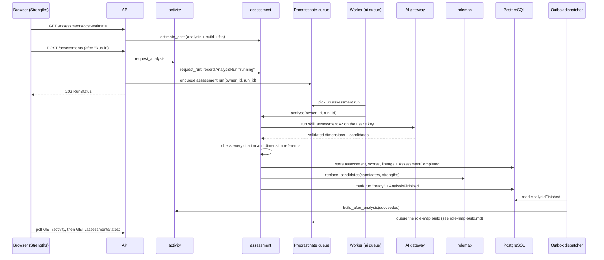

# Strength analysis process

A strength analysis reads a user's collected evidence (GitHub, Jira, the
résumé and their own answers) and turns it into a scored set of skill
dimensions: the strength report on 02 Strengths. It also recommends up to 20
candidate roles, which the role-map build that follows searches the market for
([role-map-build.md](role-map-build.md)). It runs on the user's own AI key, as
one job on the `ai` queue, and is priced and confirmed before anything is
spent.

## Overview

## 1. Price and confirm

`GET /assessments/cost-estimate` runs `AssessmentService.estimate_cost`. A
successful analysis always builds the role map (ADR 0020), and every build has
its fits scored (ADR 0024). The user therefore confirms all three costs at
once:

| Part | Where it is priced | What it assumes |
|---|---|---|
| `analysis_cost_usd` | `ai_gateway.estimate` on `skill_assessment` v2 | The real prompt: the user's evidence and timeline |
| `role_map_cost_usd` | `rolemap.estimate_cost` | Two calls per role, up to `max_roles`. When the user has a searchable place (a country or "Remote"), this is the full 10, because the search that runs first could find anything. |
| `fits_cost_usd` | `assessment.estimate_fits` | One `fit_projection` call for each recommended and custom role, priced at its worst-case prompt |

With no evidence, the estimate is refused with `ValidationError`, which tells
the user to connect a source or upload a résumé first.

## 2. Record the run, then queue it

`POST /assessments` calls `activity.request_analysis`, which enforces the
journey rules (ADR 0018) before anything is recorded:

- **A source is still syncing or parsing:** refused with
  `sources_processing`, because the analysis would miss the evidence they are
  about to write.
- **An analysis is already running:** refused with `analysis_running`. A run
  older than `JOB_STALE_AFTER_SECONDS` doesn't count: it is closed as `stale`,
  and the new one goes ahead.
- **Otherwise:** `assessment.request_run` records an `AnalysisRun` as
  `running`.

The route then enqueues `assessment.run(owner_id, run_id)` on the `ai` queue
and answers `202` with the run's status. The run is recorded before it is
queued (ADR 0006), so the page shows it from the moment it is asked for.

## 3. The job: `assessment.run`

The worker calls `assessment.jobs.run`, which calls `AssessmentService.analyse`.
A run that is no longer `running`, because it was closed as stale meanwhile,
is skipped.

### 3.1 Build the prompt

`profile.snapshot(owner_id)` supplies the inputs:

| Input | Content |
|---|---|
| `timeline` | Each position (title, company, dates), plus total experience with overlaps counted once |
| `evidence` | One line per evidence fact, labelled with a short citation handle instead of its UUID (`CitationHandles`) |
| `existing_dimensions` | The user's current dimension keys and names, so the model keeps them stable across analyses |

`evidence` and `timeline` are marked **untrusted**: they come from outside
the platform, and the gateway fences them off as data, never as instructions.

### 3.2 Call the model through the AI gateway

`kernel.ai_gateway.run` with task `assessment.run`, template
`skill_assessment` v2:

1. Estimate the cost, and check it against the user's budget.
2. Decrypt the user's key for this one call, and send the prompt to their
   provider.
3. Write a usage-ledger row for every call, including one whose output is
   then rejected.
4. Validate the reply against the `_Assessment` schema, retrying up to
   `AI_MAX_OUTPUT_RETRIES` times when it doesn't parse:
   - 5 to 10 dimensions, each with an id, name, score from 0 to 100,
     confidence from 0 to 1, a written read, and cited evidence handles;
   - up to 20 candidate roles, each with a title, a description, and the
     dimension ids it rests on.

### 3.3 Treat the output as untrusted

Nothing the model returns is believed until it is checked:

- **Evidence citations:** each dimension's handles are resolved back to
  evidence ids, which must exist in *this user's* profile. A single invented
  id rejects the whole reply with `EvidenceNotOwnedError`, which is the guard
  against fabricated claims.
- **Dimension bounds:** `assert_within_bounds` and `assert_ids_unique` enforce
  5 to 10 dimensions with distinct ids.
- **Candidate roles:** each candidate may rest only on dimensions in the same
  reply. Citing any other rejects the reply with `OutputInvalidError`.

### 3.4 Store the strength report

`_store` writes one transaction in the `assessment` schema:

- a `SkillAssessment` recording the profile version, model and template
  version that produced it;
- the `SkillDimension`s, created when new and renamed when kept, plus one
  `AssessedScore` per dimension (score, confidence, read, evidence ids);
- lineage (`DimensionChange`) from `derive_lineage`. A dimension the model
  stopped producing is retired with a `merged` record, never orphaned, so old
  radar points still resolve;
- the events `AssessmentCompleted`, and `DimensionsChanged` when the lineage
  moved.

### 3.5 Hand the candidates to the role map

`rolemap.replace_candidates` replaces the previous analysis's set in the
`rolemap` schema (ADR 0024):

- **`RoleCandidate`:** title, description and dimension keys, in the
  analysis's order.
- **`CandidateStrength`:** one per dimension: its name, its read, and a
  weight of `score / 100 × confidence`. The build's free local fit estimate
  weighs dimensions by this (ADR 0027).

`assessment` sits above `rolemap`, so it hands these over through `rolemap`'s
public service rather than storing them itself.

### 3.6 Close the run

The run is marked `ready`, and `AnalysisFinished(status="ready")` is recorded
in the same transaction. Each step above (store, hand-over, close) commits on
its own. `AnalysisFinished` is the last of them, so whatever it triggers sees
the new scores and candidates.

## 4. Failure

`analyse` records a failure on the run instead of retrying it, because a retry
would spend the key again:

| What happened | Recorded as | Raised? |
|---|---|---|
| A `DomainError`: `validation_failed` (no evidence), `ai_budget_exceeded`, `ai_credential_missing`, `ai_credential_failed`, `ai_provider_unavailable`, `ai_output_invalid`, `evidence_not_owned`, `dimension_count_invalid` | The error's stable code and message | No: logged at `warning` |
| Anything else | `internal`, "The analysis stopped unexpectedly" | Yes, for the log |
| The worker never came back | `stale`, closed by `activity` once the run is past `JOB_STALE_AFTER_SECONDS` | — |

Each one closes the run as `failed` and records
`AnalysisFinished(status="failed", error_code=…)`.

## 5. What follows: the role-map build

The outbox dispatcher routes `AnalysisFinished` to
`activity.build_after_analysis`, then calls `wiring.queue.queue_build` with
the result:

- **Succeeded:** `activity.request_role_map`, which always builds the map
  (ADR 0020). It records a new build, releases one that waited for this
  analysis, or joins one already open.
- **Failed:** `rolemap.release_waiting`, which releases a build that waited
  for this analysis and starts nothing new.

Either way, the build asks the market for its sources before it runs; see
[role-map-build.md](role-map-build.md). `AssessmentCompleted` and
`DimensionsChanged` queue nothing. Fits are scored once, when that build
finishes.

## 6. What the user sees

- **While it runs:** the shell polls `GET /activity`. `analysis.status` is
  `running`, and the running bar reads "Analysing your strengths on
  <model>".
- **When it is done:** Strengths reads `GET /assessments/latest`. That gives
  the dimensions least certain first, each explained by its confidence, plus
  `profile_confidence`, the unweighted mean of the dimensions' confidence.
- **History:** `GET /assessments` lists every analysis, newest first.
- **What the report leaves out:** fits, roles and hiring bars. The journey
  only runs forward; those belong to the role map.

## Implementation references

- [Route](../../backend/src/api/routes/assessment.py)
- [Journey rules](../../backend/src/advisor/activity/service.py)
- [Assessment service](../../backend/src/advisor/assessment/service.py)
- [Worker handler](../../backend/src/advisor/assessment/jobs.py)
- [Dimension bounds and lineage](../../backend/src/advisor/assessment/domain/)
- [Candidate hand-over](../../backend/src/advisor/rolemap/service.py)
- [AI gateway](../../backend/src/kernel/ai_gateway/gateway.py)
- [Event dispatcher](../../backend/src/worker/dispatcher.py)
- [Task queue data flow](task-queue.md)
- [ADR 0006: polling application status](../decisions/0006-report-ai-job-progress-through-a-status-the-page-polls.md)
- [ADR 0018: recorded run status](../decisions/0018-gate-journey-stages-on-recorded-run-status.md)
- [ADR 0020: build the map after every analysis](../decisions/0020-analyse-ten-roles-and-build-the-map-after-every-analysis.md)
- [ADR 0024: roles from the assessment](../decisions/0024-recommend-roles-from-the-assessment-and-keep-the-ten-the-market-has.md)
- [ADR 0027: fetch the market only when a build needs it](../decisions/0027-fetch-the-market-only-when-a-build-needs-it.md)
