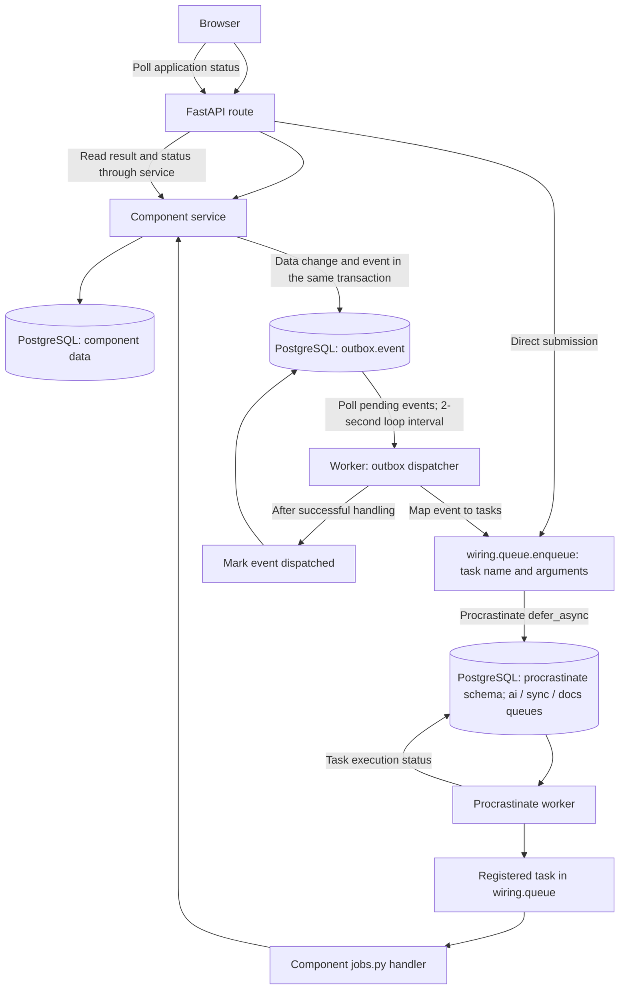
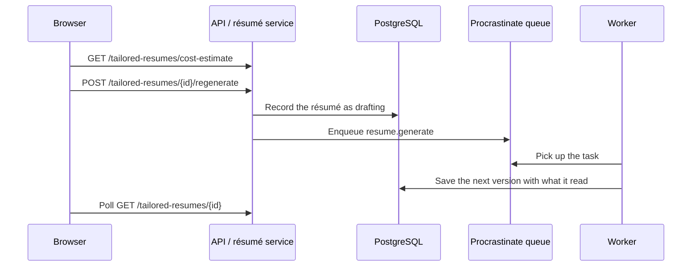

# Task queue data flow

The backend uses Procrastinate to store and execute background tasks in
PostgreSQL. Tasks enter the queue through two paths: API routes enqueue work
directly, or committed domain events trigger work through the transactional
outbox. The API uses FastAPI; event storage and dispatch are implemented in
this repository rather than by Procrastinate.

## Overview

The worker runs the outbox polling loop alongside Procrastinate's queue
consumer in the same process. These are separate responsibilities: the
outbox describes what happened, and the task queue stores work to execute.

## Queues

| Queue | Examples |
|---|---|
| `ai` | Assessment, role-map building, fit computation, gap questions, gap plans, résumé generation |
| `sync` | Connector syncing, résumé parsing, company board discovery |
| `docs` | Résumé PDF export |

Task registration assigns the queue. Each registered wrapper calls a
component's plain async function in `jobs.py`, which invokes its service.
This keeps Procrastinate out of the component's business logic.

## Direct submission

For user-requested work, an API route calls the component service to record
application state, then calls `enqueue(task_name, **arguments)`. For example,
requesting an assessment records a run and submits `assessment.run` with
its user and run identifiers. `enqueue` delegates to Procrastinate's
`defer_async`, which stores the task in its PostgreSQL schema.

This path does not pass through the outbox. Recording the application state
and submitting the task are separate operations in the current implementation.

## Submission through domain events

A component's unit of work stores its data change and event together. If the
transaction rolls back, neither is committed. Once committed, the event remains
available even if the producing process stops before any follow-up work runs.

The dispatcher reads up to 100 pending events per pass, ordered by occurrence
time, using `FOR UPDATE SKIP LOCKED` to keep concurrent dispatchers from
claiming the same row simultaneously. It routes events to follow-up actions,
which may enqueue tasks, and marks successfully handled events with
`dispatched_at`. Some events intentionally trigger no tasks.

The crawler emits no events. It fetches only the sources a waiting role-map
build asked for, and each build checks on its own sources as its owner, so
nothing resolves market changes to users (ADR 0027). The strength analysis
and the role-map build are described step by step in
[strength-analysis.md](strength-analysis.md) and
[role-map-build.md](role-map-build.md).

### Example: regenerating a résumé the user was told is outdated

Submitting gap answers queues nothing. `GapAnswersSubmitted` is recorded and
dispatched without a task: the Target's plan and résumé read as outdated by
the new evidence, and the user regenerates either at a price they confirm
([ADR 0035](../decisions/0035-regenerate-the-plan-and-resume-only-when-asked.md)).

## Completion and failure

**Dispatched does not mean completed.** It means the dispatcher successfully
handled the event, including submitting any applicable tasks. Workers execute
those tasks afterward. The browser polls application-owned status and result
records rather than Procrastinate's internal job tables.

If event handling raises an exception, the dispatcher records `attempts` and
`last_error`, leaves the event pending, and retries it on a later pass. Task
execution failures are a separate concern: handlers may record expected
business failures on application records rather than raise them.

Queue submission and marking an event dispatched do not share one transaction
in this implementation. If submission succeeds but dispatch marking fails, a
later pass can submit the task again. Consumers must account for possible
duplicate submissions; the outbox is not an exactly-once execution guarantee.

## Implementation references

- [Task submission and registration](../../backend/src/wiring/queue.py)
- [Procrastinate configuration and queue names](../../backend/src/kernel/jobs/app.py)
- [Outbox event model](../../backend/src/kernel/outbox/models.py)
- [Outbox writer](../../backend/src/kernel/outbox/writer.py)
- [Event dispatcher](../../backend/src/worker/dispatcher.py)
- [Worker entrypoint](../../backend/src/worker/main.py)
- [Architecture: communication](../architecture.md#communication)
- [ADR 0006: polling application status](../decisions/0006-report-ai-job-progress-through-a-status-the-page-polls.md)
- [ADR 0018: recorded run status](../decisions/0018-gate-journey-stages-on-recorded-run-status.md)
